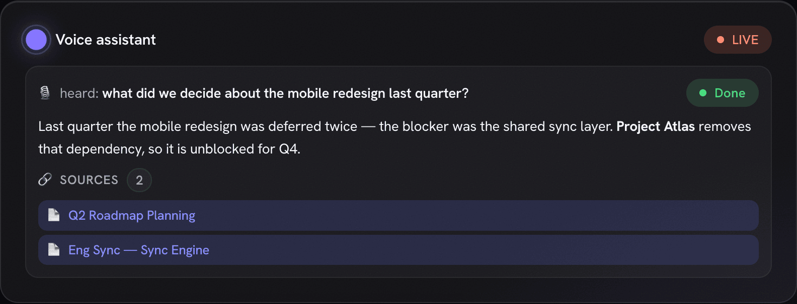
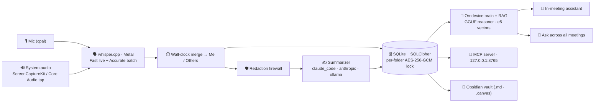

<p align="center">
  
</p>

<h1 align="center">Murmur</h1>

<p align="center">
  <b>A local-first macOS app that records your meetings, transcribes & reasons over them <i>entirely on your Mac</i>,<br/>
  and gives you an AI you can <i>talk to live, in the meeting</i> — and across everything you've ever recorded.</b>
</p>

<p align="center">
  
  
  
  
  
  
  <a href="LICENSE"></a>
</p>

<p align="center">
  <a href="https://github.com/murmur-io/murmur/releases/latest"><b>⬇️ Download</b></a> ·
  <a href="#-quick-start">Quick start</a> ·
  <a href="#-the-brain--talk-to-it-during-the-meeting">The brain</a> ·
  <a href="#-features">Features</a> ·
  <a href="#-privacy--the-lock-model">Privacy</a>
</p>

---

Most meeting tools just transcribe and ship your audio to someone else's cloud. **Murmur gives your
meetings a brain — and keeps it on your Mac.** While you're still in the call you can ask it a
question out loud and get a **grounded answer with sources**, drawn from everything you've recorded
before. After the call it writes a clean structured note and remembers it forever — searchable,
linkable, and queryable by your own AI. With Ollama or the bundled on-device model, **none of it ever
leaves the device.**

> 🎙️ **Record** → 🧠 **transcribe & reason on-device** → 💬 **ask your AI — live in the meeting** →
> 🔎 **and across your whole history.** _(And yes — every note is plain Markdown you own.)_

<p align="center">
  
  <br/><em>Mid-meeting: say the wake phrase, ask a question, and the on-device brain answers — <b>grounded, with sources</b> — without ever pausing the recording.</em>
</p>

## ✨ Why Murmur is different

- 🧠 **A brain you can talk to — mid-meeting.** Say a wake phrase (or tap **Ask AI**) and the on-device
  assistant answers out of your meeting history, **live, with citations**, while the recording keeps rolling.
- 🔒 **Truly local-first.** The brain, transcription, and search all run on your Mac. Pick a fully-local
  stack (Ollama or the bundled GGUF model) and **nothing ever leaves the device.**
- 🔎 **Memory across every meeting.** Ask one question and get an answer synthesized from months of calls,
  each claim linked back to the meeting it came from.
- 🎧 **It hears the whole call.** Your mic *and* the other side's system audio are captured and transcribed
  separately, then merged into a **Me / Others** transcript.
- 🧩 **One store, three surfaces.** An encrypted SQLite DB is the single source of truth; the app, a
  read-only **MCP server**, and your vault are thin readers — never diverging copies.
- 📁 **You own the output.** Notes are plain Markdown (and Obsidian-friendly) — no proprietary format, no lock-in.

---

## 🚀 Quick start

> **Requires macOS 13.4+ (Apple Silicon or Intel).**

**Just want to use it?** → [**Download the latest signed & notarized build**](https://github.com/murmur-io/murmur/releases/latest),
drag `Murmur.app` to Applications, and open it. A first-run wizard walks you through the Whisper model,
an AI provider, and (optionally) a vault.

<p align="center">
  
</p>

To unlock the in-meeting brain, download an on-device model (Bielik / Qwen) and turn on **realtime
reactions** in Settings — see [Providers & the on-device brain](#-providers--the-on-device-brain).
Building from source? Jump to [Development](#-development).

---

## 🧠 The brain — talk to it during the meeting

This is the part most note-takers don't have. Murmur runs a reasoning model **on your Mac** and keeps a
semantic index of everything you've recorded — so it can answer questions *in the moment*.

<p align="center">
  
</p>

- 💬 **In-meeting voice assistant.** Trigger it by **wake phrase** or a single **Ask AI** click
  (click-to-stop, so it captures your whole question). It answers from your meeting memory **live**, the
  answer and its `[[sources]]` appearing right in the recording view — the recording never stops.
- 🧠 **On-device reasoner.** A curated GGUF brain (**Bielik-11B**, **Qwen3-14B**, **Qwen2.5-3B**) runs
  locally via `mistralrs` (Metal). It's always compiled in and activates the moment a model is downloaded.
- 🎯 **Grounded, not hallucinated.** Every answer is retrieved from your own transcripts and notes first,
  then summarized — with the source meetings cited as chips you can open.
- 🌐 **Optional live web** (off by default). A consent-gated **Brave** connector (BYO key) lets the brain
  reach the web when you ask it to; web hits are shown distinctly as “via web”, and queries are redacted
  before they leave.
- 🔌 **Your call on where it runs.** Local model = nothing leaves your Mac; or point the brain at Claude
  for lower live latency. Off by default — it's a power feature you opt into.

## 🔎 Ask across every meeting

<p align="center">
  
  <br/><em>Ask Your Vault — one question, answered across months of meetings, every claim linked to its source.</em>
</p>

- **Ask Your Vault** — full-page grounded chat across all your (visible) meetings, every answer linked back
  to the meetings it came from. Single-meeting chat cites time-indexed transcript segments.
- **Hybrid retrieval** — keyword search (FTS) fused with on-device **semantic vectors**
  (`multilingual-e5-small`, 384-dim, `sqlite-vec` KNN, Reciprocal Rank Fusion). On-device, off by default,
  one-time backfill to enable.
- **Related meetings** (semantic neighbors) and **entity dossiers** that synthesize a person or project
  across everything they touched.

<p align="center">
  
  <br/><em>People & Projects, extracted automatically and counted — sealed folders stay hidden.</em>
</p>

---

## 🧭 Features

### 🎙️ Capture & transcribe

<p align="center">
  
</p>

- **Dual-stream recording** — microphone (`cpal`) **plus** the other side's system audio (a Swift
  **ScreenCaptureKit** sidecar, or a **Core Audio process tap** on macOS 14.4+), transcribed independently
  and merged by host wall-clock into **Me / Others**.
- **On-device Whisper** (`whisper.cpp` via `whisper-rs`, **Metal**). A *Fast* pass drives ~3-second live
  captions while you record; an *Accurate* beam-search pass (anti-hallucination gates) runs once after you stop.
- **Best-effort extras, graceful by default** — Silero **VAD**, optional **speaker diarization** of the
  others stream, and opt-in hi-fidelity native-rate masters; each degrades cleanly when its model is absent.
- **Guardrails** — a 4-hour cap, live mic-mute that preserves sync, an input-device picker, and detection
  of a running meeting app (Zoom / Teams / Webex). Whisper sizes `tiny`…`large-v3` (default **large-v3**)
  download once from Settings.

<p align="center">
  
  <br/><em>The signature floating recorder bar (<code>⌘⇧R</code>) — record (and ask) from anywhere.</em>
</p>

### 📝 Notes & structure

<table>
  <tr>
    <td width="50%"></td>
    <td width="50%"></td>
  </tr>
  <tr>
    <td align="center"><em>A structured note — summary, decisions, action items, quotes.</em></td>
    <td align="center"><em>The merged <b>Me / Others</b> transcript, time-indexed.</em></td>
  </tr>
</table>

- **Structured notes** generated from the transcript: summary, decisions, action items, and notable quotes —
  re-summarize any meeting with a different model.
- **Recipes** turn a transcript into emails, decision logs, or action lists; action items can push to **Apple Reminders**.
- **Timeline & more** — an interactive **speaker + topic timeline**, pin-a-moment block refs, weekly
  **digests**, deterministic cross-meeting **Topic Threads**, and a calendar-aware **pre-meeting brief**
  (on-device EventKit, zero-OAuth).

<p align="center">
  
</p>

<table>
  <tr>
    <td width="50%"></td>
    <td width="50%"></td>
  </tr>
  <tr>
    <td align="center"><em>Library — folders, tags, and lock-aware rows.</em></td>
    <td align="center"><em>Totals, a 30-day activity chart, and a status breakdown.</em></td>
  </tr>
</table>

### 📁 Yours to keep

A nice-to-have, not a lock-in: every note is also exported as plain **Obsidian Markdown** — atomic `.md`
with YAML front-matter, `[[wikilinks]]`, `obsidian://` deep-links, and a `.canvas` board option. People and
projects mirror into vault stub notes, so your Obsidian graph builds itself. Don't use Obsidian? The files
are still just Markdown you own. (The encrypted SQLite DB — not the vault — is the source of truth.)

---

## 🏗️ Architecture

Murmur is a **Tauri 2.11** desktop app: a **Rust** core (crate `murmur`, lib `meetnotes_lib`, bin `Murmur`)
talks to an **Angular 18 zoneless** frontend over Tauri IPC. There's no NgRx — every screen is a standalone
*signals* component calling a single `IpcService`. The Rust side captures, transcribes, summarizes, and
persists everything to **one SQLCipher-encrypted SQLite database** — the canonical store. Over it sit the
**on-device brain** (reasoning + RAG that power the in-meeting assistant and Ask), plus three read surfaces:
the app UI, a read-only **MCP server**, and your Obsidian vault.



**The pipeline, stage by stage:** capture (mic + optional system audio) → resample/segment → transcribe
each stream on-device → merge by wall-clock into Me/Others → persist to the SQLCipher DB → summarize (any
cloud-bound text first passes the redaction firewall) → export the note atomically. Status events stream to
the UI at each stage.

---

## 🔒 Privacy & the lock model

Privacy isn't a setting in Murmur — it's the architecture. The brain, transcription, and search are designed
to run **without a network**.

<p align="center">
  
  <br/><em>Murmur tells you, in plain language, exactly what leaves your Mac.</em>
</p>

**What runs where — honestly:**

| Brain / provider | Where it runs | Does meeting text leave your Mac? |
| --- | --- | --- |
| **On-device brain** (Bielik / Qwen GGUF) | Fully local | **No.** Reasoning + the in-meeting assistant, on-device. |
| **Ollama** | Fully local | **No.** Nothing leaves the device. |
| **Claude Code** (default summarizer) | Local CLI → Anthropic's cloud | **Yes** — the *redacted* transcript is sent to Anthropic. |
| **Anthropic API** (BYO key) | Direct HTTPS → Anthropic | **Yes** — the *redacted* transcript is sent to Anthropic. |

- 🧱 **Two encryption layers at rest.** The **whole** SQLite DB is **SQLCipher**-encrypted (key in the
  macOS Keychain). On top, a **per-folder lock** adds **AES-256-GCM** content keys wrapped by a master KEK
  released only by a **Touch ID** prompt — no app-side password.
- 🚪 **Every read is gated.** A sealed-and-not-unlocked meeting leaks nothing — across the app, search, the
  graph, MCP, and even the audio asset path. Its title shows as `🔒 Locked`.
- ♻️ **Seals verify-before-destroy.** Murmur proves the ciphertext decrypts *before* it ever blanks the
  plaintext — content is never lost — and re-locking is fully reversible.
- 🛡️ **Redaction firewall.** Emails, card-like numbers, and phone numbers are *always* scrubbed before any
  cloud call; **person-name** redaction kicks in when the on-device NER model is installed.
- ✅ **Cloud egress is fail-closed.** No meeting text reaches a cloud provider until you grant a one-time
  consent — a flag a normal settings save can't flip.
- 📺 **Screen-share aware.** A best-effort watcher can auto-relock sealed folders and zeroize the cached key
  the moment screen sharing is detected.

> ⚠️ **Honest caveat:** Touch ID, lock-at-rest, and screen-share auto-relock only *truly* verify on a
> **Developer-ID-signed build** (the published releases). An unsigned local dev build degrades biometrics to
> a permissive stub — handy for development, not a security guarantee.

---

## 🤖 Providers & the on-device brain

<table>
  <tr>
    <td width="50%"></td>
    <td width="50%"></td>
  </tr>
</table>

The **summarizer** is one `SummarizerProvider` trait with three swappable backends — **`claude_code`**
(default), **`anthropic`** (BYO Keychain key), and **`ollama`** (local). Separately, the heavy on-device ML —
the **mistralrs** GGUF brain, the **candle** e5 embedder, and the **candle** DeBERTa NER redactor — is
**always compiled in** (no cargo feature flags) and activates at runtime **only when its model files are
present**, otherwise degrading to a clean no-op.

### 🧩 The MCP server

Murmur runs a **read-only Model Context Protocol** server on `127.0.0.1:8765` so Claude Desktop / Claude Code
can query your meeting memory **with zero egress**. Six tools — `search_meetings`, `get_meeting`,
`list_recent_meetings`, `search_semantic`, `get_open_commitments`, `get_entity_dossier` — all routed through
the same visibility gates (sealed meetings stay invisible), with a bearer token **required by default**.

---

## 🛠️ Development

<details>
<summary><b>Toolchain</b></summary>

- **Rust** (`rustup`, toolchain pinned to **1.96.0**) — `curl --proto '=https' --tlsv1.2 -sSf https://sh.rustup.rs | sh -s -- -y`
- **Node** + npm
- **cmake** + **clang / Xcode CLT** — builds `whisper.cpp` and the Metal toolchain (`brew install cmake pkg-config`, `xcode-select --install`)
</details>

```bash
git clone https://github.com/murmur-io/murmur.git && cd murmur
npm install
source ~/.cargo/env

# Dev run. MURMUR_DEV_DEK uses a fixed dev DB key so each rebuild doesn't re-prompt
# the Keychain. No --features needed — the ML/brain stack is always compiled.
MURMUR_DEV_DEK=0123456789abcdef0123456789abcdef0123456789abcdef0123456789abcdef npm run dev
#   → Angular on http://localhost:1420, MCP on 127.0.0.1:8765
```

> A **cold** first build compiles the full `mistralrs` / `candle` ML tree (hundreds of MB) — let it finish;
> the incremental loop is fast once warm.

**Quality gates**

```bash
( cd src-tauri && cargo test --lib )   # ~128 fast unit tests (the inner loop)
npx ng lint
npx ng build
bash scripts/ci.sh                      # full gate: clippy -D warnings + tests + lint + build + headless E2E
```

### 🧱 Tech stack

| Layer | Tech |
| --- | --- |
| **Shell** | Tauri 2.11 · Rust (edition 2021, toolchain 1.96) · macOS-first, universal (arm64 + x86_64), min macOS 13.4 |
| **Frontend** | Angular 18.2 **zoneless** · standalone + signals · TypeScript 5.5 · `marked` + `DOMPurify` · **no NgRx** |
| **Audio** | `cpal` · `whisper-rs` (Metal) · ScreenCaptureKit / Core Audio tap · `sherpa-onnx` diarization |
| **On-device brain** | `mistralrs` (GGUF reasoner) · `candle` (e5 embeddings + DeBERTa NER) · `sqlite-vec` |
| **Storage / crypto** | `rusqlite` + **SQLCipher** · `aes-gcm` + `zeroize` · macOS Keychain · Touch ID (`LAContext`) |

### 📂 Project layout

```
murmur/
├─ src/             Angular 18 frontend (standalone, zoneless, signals)
│  └─ app/
│     ├─ core/        ipc.service.ts · models.ts · recorder.store.ts · assistant.store.ts
│     └─ features/    record · library · detail · folders · graph · ask · analytics · settings · onboarding · bar
├─ src-tauri/       Rust core (Tauri 2)
│  └─ src/           commands.rs · pipeline.rs · reason.rs · embed.rs · mcp.rs · crypto.rs · audio/ · transcribe/ · summarize/ · storage/ · secrets/ · export/
└─ docs/            design notes, research, branding, screenshots
```

---

## 🗺️ Status

Murmur ships at **v0.6.3** — a signed, notarized macOS app. The full record → transcribe → summarize
pipeline, the in-meeting voice assistant, the on-device brain + semantic search, the per-folder Touch ID
lock, the knowledge graph, Ask-Your-Vault, and the MCP server are all implemented. Some capabilities — live
ScreenCaptureKit capture, the Touch ID prompt, and screen-share auto-relock — can only be *fully* exercised
on a signed build on a real Mac, and are documented as such.

> Screenshots in this README are the real Angular UI rendered from the shipping code, populated with demo
> data (no private meetings).

## 📄 License

Murmur is open source under the [GNU AGPL-3.0](LICENSE) license.

---

<p align="center"><sub>🍎 macOS-first · 🧠 on-device brain · 🔒 local-first · built with Tauri + Angular + Rust</sub></p>
