<p align="center">
  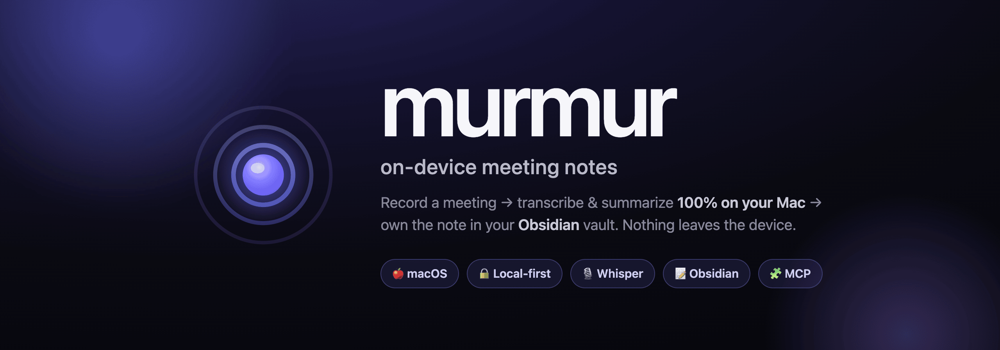
</p>

<h1 align="center">Murmur</h1>

<p align="center">
  <b>A local-first macOS app that records your meetings, transcribes & reasons over them <i>entirely on your Mac</i>,<br/>
  and gives you an AI you can <i>talk to live, in the meeting</i> — and across everything you've ever recorded and written.</b>
</p>

<p align="center">
  
  
  
  
  
  
  
  <a href="LICENSE"></a>
</p>

<p align="center">
  <a href="https://murmurnotes.io/#product"><b>▶︎ Watch the 90-second tour</b></a>
</p>

<p align="center">
  <a href="https://murmurnotes.io/#product">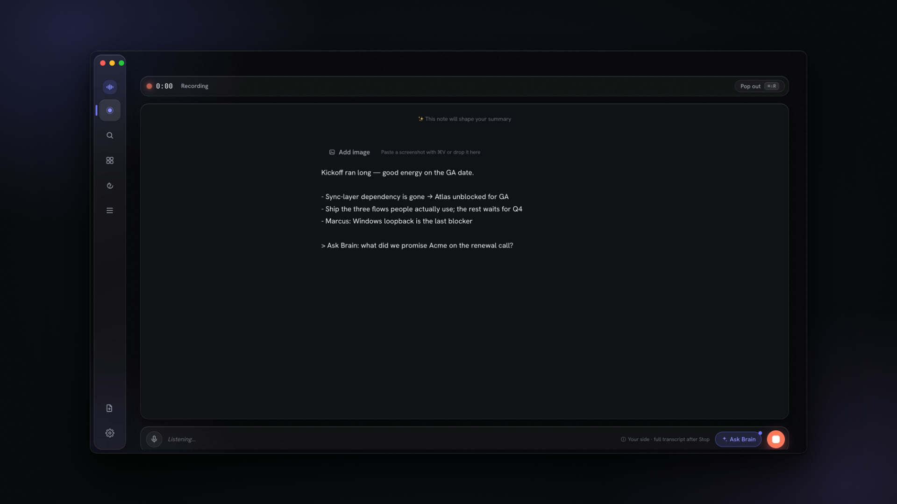</a>
</p>

<p align="center">
  <a href="https://github.com/murmur-io/murmur/releases/latest"><b>⬇️ Download</b></a> ·
  <a href="#-quick-start">Quick start</a> ·
  <a href="#-the-brain--your-meeting-memory-you-can-talk-to">The brain</a> ·
  <a href="#-features">Features</a> ·
  <a href="#-spaces-boards--imports">Spaces &amp; boards</a> ·
  <a href="#-notes">Notes</a> ·
  <a href="#-shared-brain-org">Shared Brain</a> ·
  <a href="#-architecture">Architecture</a> ·
  <a href="#-the-mcp-server">MCP</a> ·
  <a href="#-privacy--the-lock-model">Privacy</a>
</p>

---

Most meeting tools just transcribe and ship your audio to someone else's cloud. **Murmur gives your
meetings a brain — and keeps it on your Mac.** While you're still in the call you can jot a note, drop
`@brain` in front of a question, and get a **grounded answer with sources** drawn from everything
you've recorded before — the recording never stops. After the call it writes a clean structured note
and remembers it forever: searchable, linkable, and queryable by your own AI. Write standalone notes
too — same brain, same lock model, same ownership. With Ollama, the bundled on-device model, or
`claude_code`, **none of it ever leaves the device.** And when you want to share what you know, an
opt-in, end-to-end-encrypted **Shared Brain** lets your whole org search each other's notes — free,
zero-knowledge, no plaintext ever touching a server.

> 🎙️ **Record** → 🧠 **transcribe & reason on-device** → 💬 **ask your brain — live in the meeting** →
> 🔎 **and across your whole history — meetings and notes.** _(And yes — every note is plain Markdown you own.)_

<p align="center">
  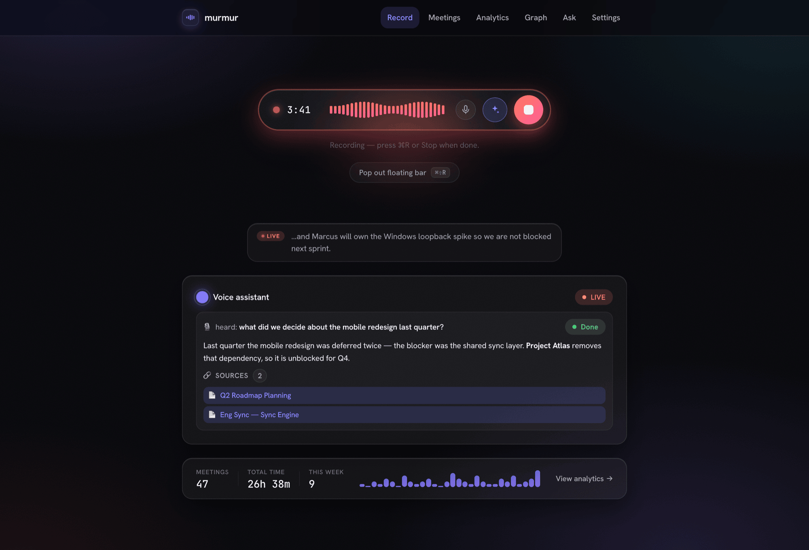
  <br/><em>Mid-meeting: take notes as you go, type <code>@brain</code> + a question to open a thread, and the
  on-device brain answers — <b>grounded, with sources</b> — without ever pausing the recording.</em>
</p>

## ✨ Why Murmur is different

- 🧠 **A brain you can talk to — mid-meeting.** Type `@brain` in your notes (or tap the mic) and the
  on-device assistant answers out of your meeting history, **live, with citations**, in a Slack-style
  thread — while the recording keeps rolling.
- 🤝 **The agent proposes, you accept.** The brain never writes to your notes on its own. When it drafts
  something useful it offers a quiet **"✓ Add to notes"** — nothing enters your notes unless you say so.
- 🔒 **Truly local-first.** The brain, transcription, and search all run on your Mac. Pick a fully-local
  stack (Ollama or the bundled GGUF model) and **nothing ever leaves the device.**
- 🗂️ **One hierarchy: Spaces.** Recordings and notes live in the same tree — **Spaces › folders ›
  items** — not in two parallel folder systems. Lock a Space and everything inside it is sealed with it.
- 📊 **Dashboards you compose.** Put notes, recordings, documents, people, promise ledgers and reminders
  on a board, pin a **living answer** the app keeps current, and read it through Brief / Overview /
  Commitments / Sources / People lenses. A board's sources going locked withholds the answer.
- 📥 **Bring the notes you already have.** Import a Notion export, an Obsidian vault, or Apple Notes —
  entirely offline, dry-run first, no token and no account.
- 📝 **A real notes product, not an afterthought.** A standalone Markdown editor filed in the same
  Spaces as your recordings, with the same lock lifecycle, a 19-action AI command menu, and per-note end-to-end-encrypted sharing — for
  writing that never came from a recording.
- 🌐 **A Shared Brain for your org — free, E2EE.** Opt in and publish notes or meetings into a
  zero-knowledge shared pool your teammates' apps replicate and search locally. The server only ever
  sees ciphertext.
- 🔎 **Memory across every meeting *and* every note.** Ask one question and get an answer synthesized from
  months of calls and writing, each claim linked back to where it came from.
- 🎧 **It hears the whole call.** Your mic *and* the other side's system audio are captured and transcribed
  separately, then merged into a **Me / Others** transcript.
- 🧩 **One store, three surfaces.** An encrypted SQLite DB is the single source of truth; the app, a
  read-only **MCP server**, and your exported Markdown files are thin readers — never diverging copies.
- 📁 **You own the output.** Notes are plain Markdown — no proprietary format, no lock-in.
- 🪟 **A Liquid Glass shell (macOS 26).** Floating glass rails that collapse into an Apple TV-style pill bar,
  a **⌘K** spotlight over your whole vault, **⌘N** for a new note, light/dark, and a transparency slider that
  honors macOS "Reduce transparency".

---

## 🚀 Quick start

> **Requires macOS 13.4+ (Apple Silicon or Intel).**

**Just want to use it?** → [**Download the latest signed & notarized build**](https://github.com/murmur-io/murmur/releases/latest),
drag `Murmur.app` to Applications, and open it. A first-run wizard walks you through the Whisper model,
an AI provider, and (optionally) a Markdown vault folder to export into.

<p align="center">
  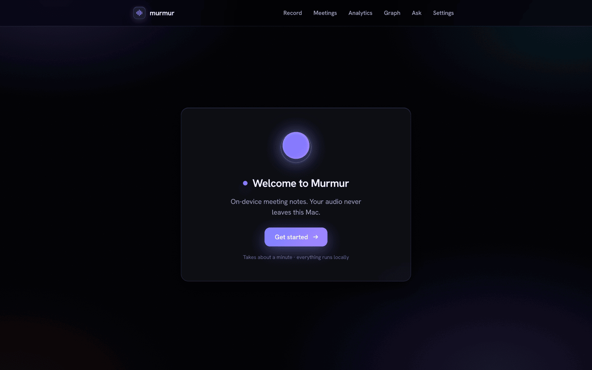
</p>

To run the in-meeting brain fully offline, download an on-device model (Bielik / Qwen) and turn on
**realtime reactions** in Settings — it gives grounded, cited answers on device. The full model-driven
**agentic loop** (the brain chooses which tools to call) runs with a **provider connection** — including
local **Ollama** — while a downloaded on-device model uses a grounded retrieval floor. See
[Providers & the on-device brain](#-providers--the-on-device-brain).
Want Shared Brain / cross-device sharing? A free account (opt-in, no card) unlocks it — see
[Shared Brain (org)](#-shared-brain-org).
Building from source? Jump to [Development](#-development).

---

## 🧠 The brain — your meeting memory you can talk to

This is the part most note-takers don't have. Murmur treats **everything you record and write as one
brain**: your transcripts and notes are the memory, an on-device (or cloud) model is the reasoning, and
internal retrieval + consent-gated connectors are the tools. You talk to it live in the meeting, ask it
across your whole history, and browse what it knows — all over the same store.

### 💬 Live, in the meeting

<p align="center">
  
</p>

- **Notes-first, thread-native.** The record screen is a calm notes surface. Jot as you go; drop a
  standalone **`@brain`** to open an anchored, multi-turn **thread** where the assistant answers — the
  recording bar stays out of the way at the top.
- **Voice *or* text, one loop.** Ask by voice (wake phrase or a single **Ask AI** click, click-to-stop
  so it catches your whole question) or by typing `@brain` — both funnel through the **same brain**. With a
  **provider connection** (including local **Ollama**) it's a model-driven **agentic loop** that decides
  which gated tools to call, with a live tool-trace ("Searching notes… ✓"); a downloaded on-device model
  answers from a grounded retrieval floor instead.
- **Three-tier cascade.** The live assistant checks the current meeting first, then your whole vault
  (meetings + notes), then — only if you've enabled connectors — the web, Jira, Slack, or your org's
  Shared Brain. It escalates deterministically only when the closer tier can't answer.
- **Grounded, not hallucinated.** Every answer is retrieved from your own transcripts and notes first,
  then summarized — with the source meetings cited as chips you can open.
- **✨ Ask brain on any note.** Hover a note and hit **✨ ask brain** to open a thread seeded from that
  line — the note stays a note; the thread just hangs under it.
- **Read-only, always.** At every tier the model can draft something for you, but it never writes to a
  note or a meeting on its own — you click "Add to notes."

### 🗂️ The `/brain` hub — what it knows

<p align="center">
  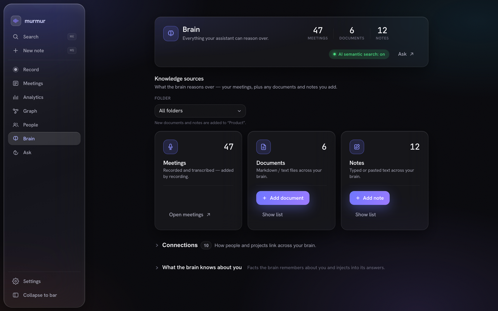
  <br/><em>Everything the assistant can reason over, in one place — meetings, imported documents, typed notes, and standalone Notes.</em>
</p>

- **One page for your whole brain.** A status header counts your (visible) **meetings**, **documents**,
  and **notes**, shows whether semantic search is on, and links straight to Ask.
- **Expand it with your own sources.** Drop in a **PDF** (scanned pages fall back to on-device Apple
  Vision OCR), a **Word / PowerPoint / Excel** file, an **HTML** page, Markdown/text, or even a
  screenshot — or paste a quick **note**. Each is extracted, chunked, and (when the on-device embedding
  model is present) vector-indexed into the same brain, gated by the same per-folder lock.
- **See the connections.** A collapsible graph shows how people and projects link across everything.

### 🔎 Ask across every meeting — and every note

<p align="center">
  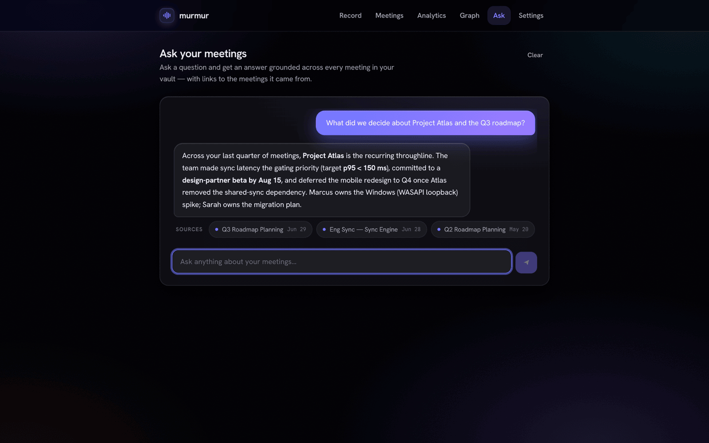
  <br/><em>Ask Your Vault — one question, answered across months of meetings and notes, every claim linked to its source.</em>
</p>

- **Ask Your Vault** — full-page grounded chat across all your (visible) meetings and notes, answered by
  the same agentic loop, every answer linked back to where it came from. Single-meeting chat cites
  time-indexed transcript segments.
- **Hybrid retrieval** — keyword search (FTS5/BM25) fused with on-device **semantic vectors**
  (`multilingual-e5-small`, 384-dim, `sqlite-vec` KNN) and a deterministic entity co-mention graph. On
  device and **on by default**; it downloads a ~470 MB on-device embedding model from Settings to
  activate, and falls back to keyword search until then.
- **Related meetings** (semantic neighbors) and **entity dossiers** that synthesize a person or project
  across everything they touched.

<p align="center">
  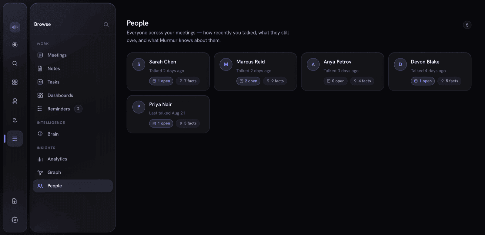
  <br/><em>Everyone across your meetings: how recently you talked, what they still owe you, and how many
  durable facts the brain holds about them.</em>
</p>

<p align="center">
  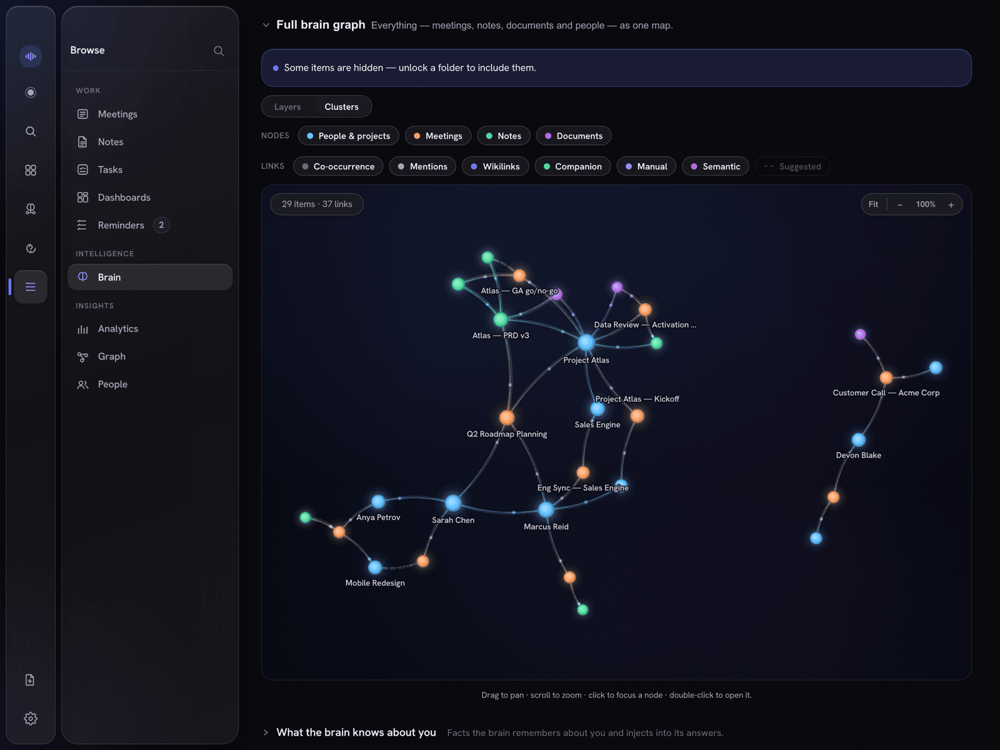
  <br/><em>The full brain graph — meetings, notes, documents and people as one map, with typed links
  (co-occurrence, mentions, wikilinks, companion, manual, semantic) and suggested links drawn dashed.
  Sealed Spaces produce no nodes, and the map says so rather than pretending it is complete.</em>
</p>

<p align="center">
  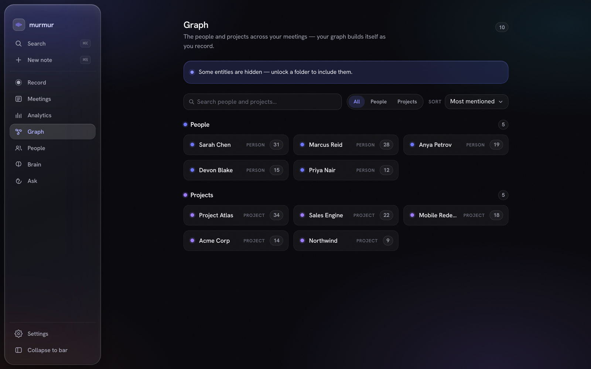
  <br/><em>The same graph as a list when you just want to find someone: people and projects with their
  mention counts, searchable and sortable.</em>
</p>

---

## 🧭 Features

### 🎙️ Capture & transcribe

<p align="center">
  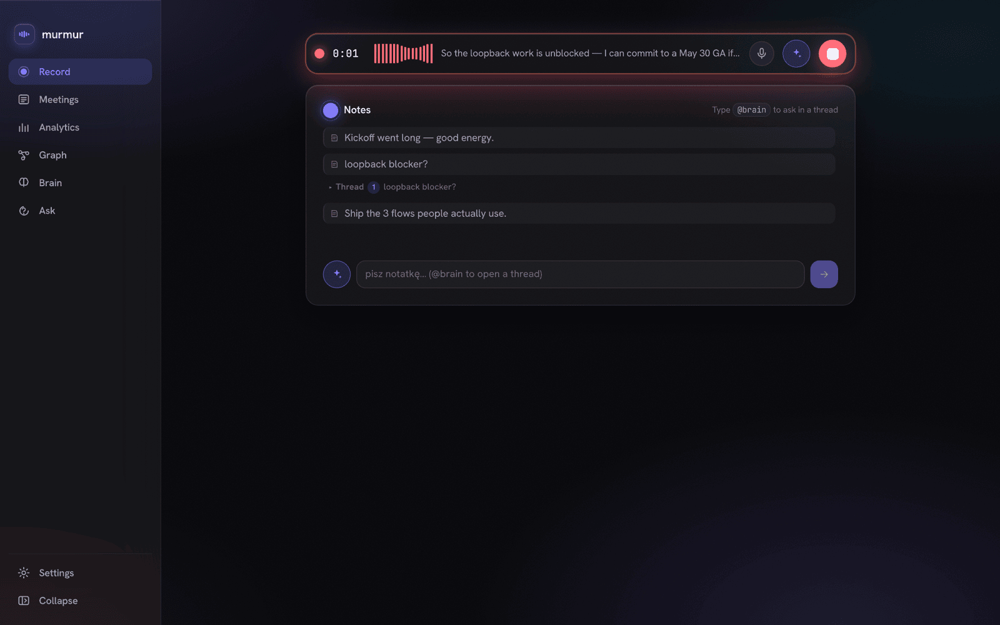
</p>

- **Dual-stream recording** — microphone (`cpal`) **plus** the other side's system audio (a **Core Audio
  process tap** on macOS 14.4+, falling back to a Swift **ScreenCaptureKit** sidecar on 13–14.3), each
  transcribed independently on its own wall-clock anchor and merged into a time-ordered **Me / Others**
  transcript. Denied system-audio permission degrades gracefully to mic-only.
- **On-device Whisper** (`whisper.cpp` via `whisper-rs`, **Metal**). A *Fast* pass drives live captions
  while you record (VAD-gated, thermally governed); an *Accurate* beam-search pass (anti-hallucination
  gates, previous-text conditioning) runs once after you stop, pre-segmented by Silero VAD with a bounded
  decode window so memory stays capped even on very long meetings.
- **Live captions are mic-only until you stop.** During the call, the live captions (and the live `@brain`
  context) transcribe *your* microphone; the other side's system audio is captured in parallel and folded
  into the full **Me / Others** transcript only after you stop.
- **Optional CPU-only NVIDIA Parakeet live-ASR engine** for live captions on capable Macs (falls back to
  Whisper silently) — the authoritative post-meeting transcript always runs through Whisper.
- **Best-effort extras, graceful by default** — cross-stream echo suppression (headphone users untouched),
  optional **N-way speaker diarization** of the others stream, offline **and** online echo cancellation
  with raw-mic fallback, opt-in on-device voiceprints, and opt-in hi-fidelity native-rate masters; each
  degrades cleanly when its model is absent.
- **Crash-safe.** A raw mic-buffer spill written every ~1s means a crash, a `SIGKILL`, or a dev rebuild
  mid-recording still salvages a real transcript and note on next launch.
- **Guardrails** — a 4-hour cap, live mic-mute that preserves sync, an input-device picker, and a thermal
  governor that backs off the *live* loop under heat (recording and the batch pipeline are never
  throttled). Whisper sizes `tiny`…`large-v3` (+ quantized variants) download once from Settings, with a
  machine-conditional smart default.

<p align="center">
  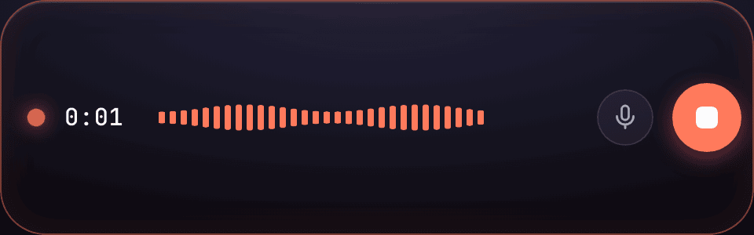
  <br/><em>The signature floating recorder bar (<code>⌘⇧R</code>) — record (and ask) from anywhere.</em>
</p>

### 📝 Notes & structure — meetings

<table>
  <tr>
    <td width="50%">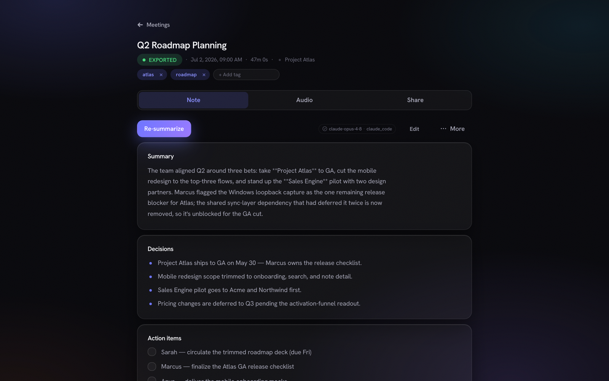</td>
    <td width="50%">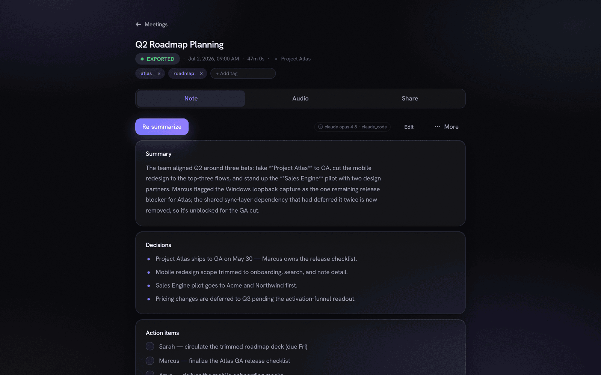</td>
  </tr>
  <tr>
    <td align="center"><em>A structured note — summary, decisions, action items, quotes.</em></td>
    <td align="center"><em>The merged <b>Me / Others</b> transcript, time-indexed.</em></td>
  </tr>
</table>

- **Structured notes** generated from the transcript: summary, decisions, action items, and notable quotes —
  re-summarize any meeting with a different model.
- **Recipes** turn a transcript into emails, decision logs, or work tickets; action items can push to **Apple Reminders**.
- **Timeline & more** — an interactive **speaker + topic timeline**, pin-a-moment block refs, weekly
  **digests**, and deterministic cross-meeting **Topic Threads**. Your on-device macOS **calendar**
  (EventKit, zero-OAuth) is reachable on demand as the brain's `calendar_lookup` tool when you ask in
  Ask / `@brain` (e.g. "who's in my next meeting?") — there is no standalone proactive brief screen.

<p align="center">
  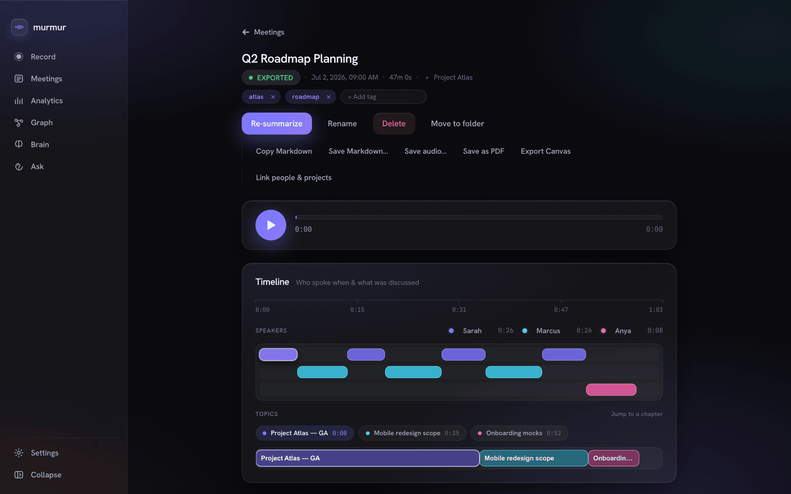
</p>

<table>
  <tr>
    <td width="50%">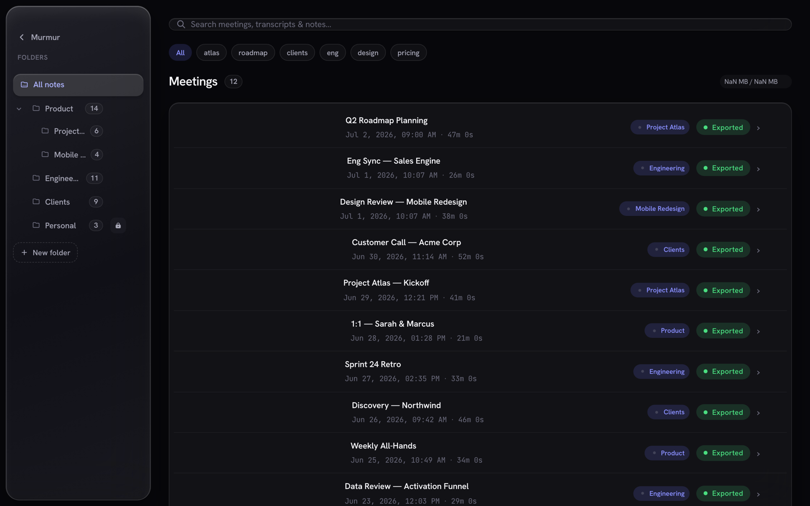</td>
    <td width="50%">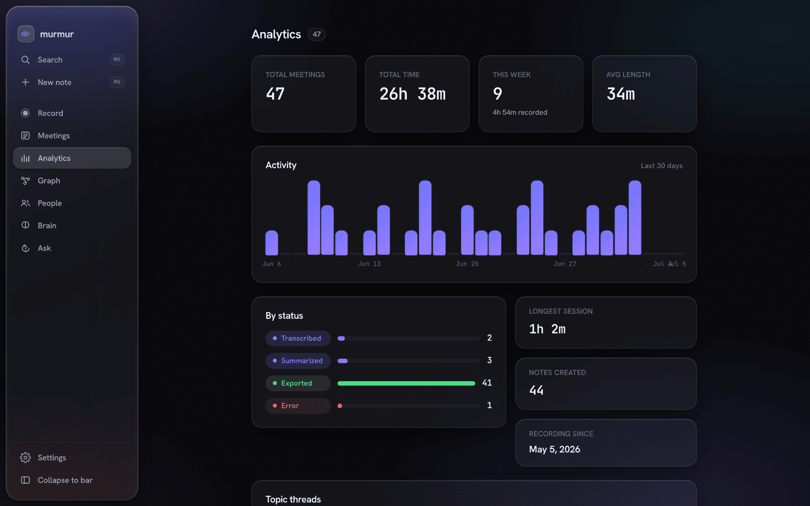</td>
  </tr>
  <tr>
    <td align="center"><em>Library — folders, tags, lock-aware rows (🔒 sealed folders), and shared-brain items merged in.</em></td>
    <td align="center"><em>Totals, a 30-day activity chart, and a status breakdown.</em></td>
  </tr>
</table>

### 🧾 Receipts — every claim traces back to the tape

<p align="center">
  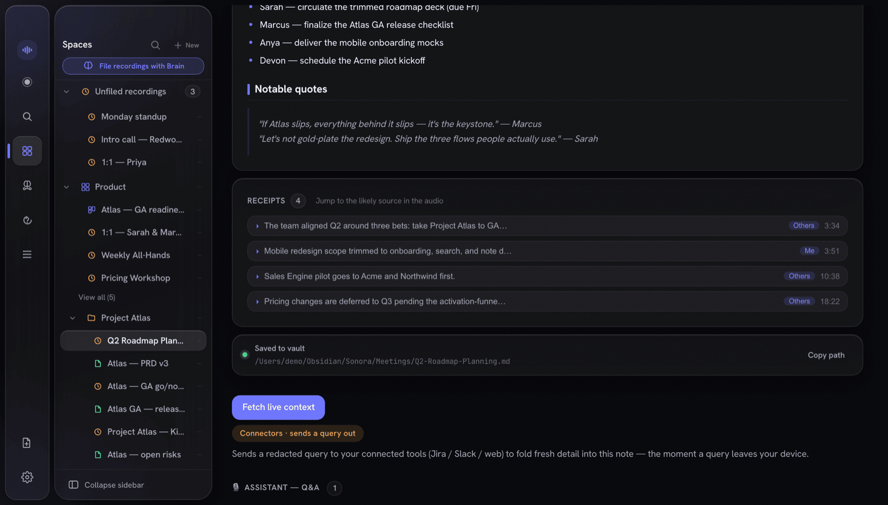
  <br/><em>One row per grounded claim, each a jump to the second of audio it came from — with the
  speaker and the ASR confidence.</em>
</p>

- **Murmur's notes don't ask you to trust them.** Each line that aligns to something actually said gets a
  receipt; paraphrased or unsupported lines get none, so you can see at a glance what is verified.
- **A receipt is a jump.** Click it and the audio seeks to that second, with the speaker attributed.
- **A sealed meeting leaks no timing and no speaker** — the backend returns no receipts at all for a
  meeting you have not unlocked, so the absence is a gate, not an accident.

### 📁 Yours to keep

A nice-to-have, not a lock-in: every note is also exported as plain **Markdown** — atomic `.md`
with YAML front-matter, `[[wikilinks]]`, block-level deep-links, and a `.canvas` board option. People and
projects mirror into vault stub notes, so your graph builds itself in your files too. They're just plain
Markdown you own, openable in any editor. (The encrypted SQLite DB — not the vault — is the source of truth.)

---

## 🗂️ Spaces, boards & imports

The three structural changes 2.0 made. Everything above lives inside them.

### 🗂️ Spaces — one hierarchy

<p align="center">
  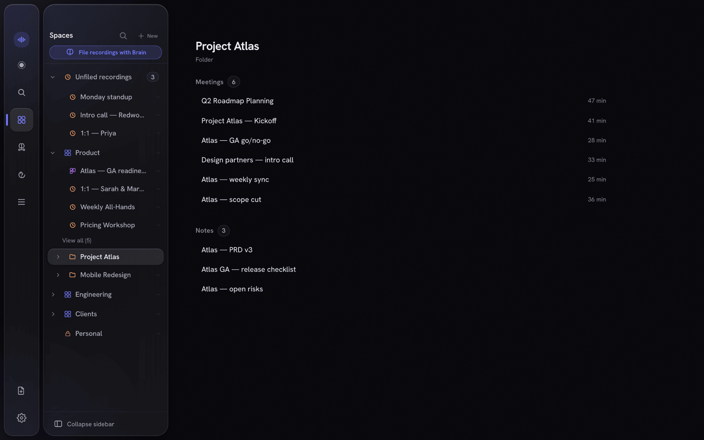
  <br/><em>One tree: <b>Spaces › folders › your recordings, notes, tasks and boards</b>. The separate
  Meetings and Notes folder trees are gone.</em>
</p>

- **One tree, four kinds of thing.** A Space holds folders; a folder holds recordings, notes, tasks and
  boards. There is no second hierarchy to keep in sync, and no item that belongs to "notes" rather than
  to a project.
- **A persistent icon rail plus a contextual panel.** The rail is always there (Capture, Search, Spaces,
  Shared Brains, Ask, Browse, New note, Settings); the panel beside it switches between the Spaces tree
  and a flat Browse view of every kind.
- **Lock a Space and everything inside it is sealed with it.** A project lock cascades to each child
  folder in its own right, so every existing visibility gate applies unchanged.
- **Brain-assisted filing.** "File recordings with Brain" proposes where stray recordings belong; you
  review the plan and nothing moves until you approve it.

<p align="center">
  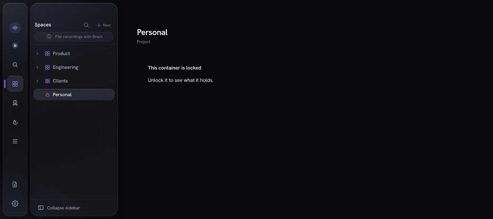
  <br/><em>A sealed Space discloses its <b>name</b> — which is what you need in order to unlock it — and
  nothing else. No counts, no children, no items, not even totals.</em>
</p>

### 📊 Dashboards — boards you compose

<p align="center">
  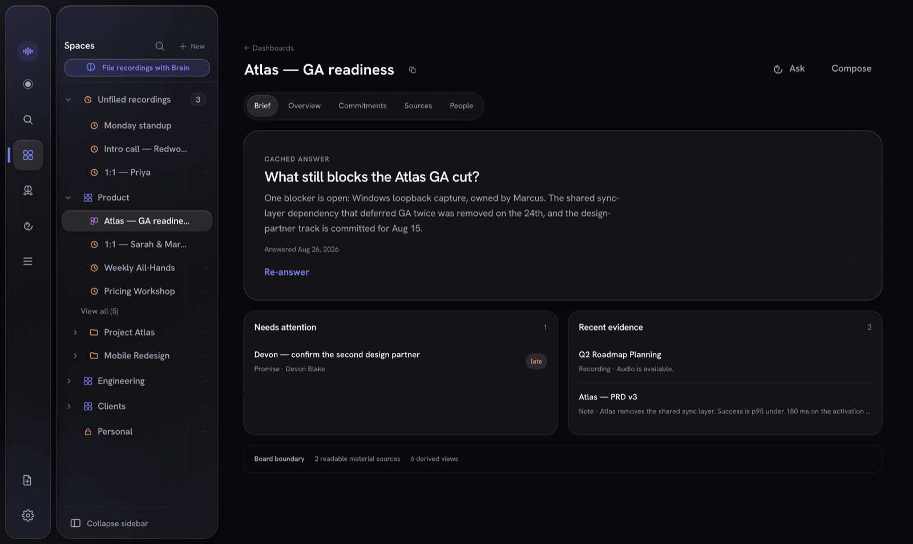
  <br/><em>The <b>Brief</b> lens: a pinned living answer, what needs attention, and the evidence behind it.</em>
</p>

- **Ten kinds of tile** — a note, a recording, a document, a person, a reminders list, a **drift** watch
  (how a fact changed over time), a **numbers** roll-up, an activity **pulse**, a **promise ledger**, and
  a **living answer**.
- **A living answer** is a question the app keeps up to date. It reports when it was last answered, and
  it **withholds itself** the moment any source it drew on stops being readable.
- **Five lenses over the same tiles** — **Brief / Overview / Commitments / Sources / People**. No lens
  keeps a second copy of anything.
- **Ask a board directly**, grounded only in what is on it — and the board states its own boundary: how
  many sources it can actually read, and how many views it derived from them.

<p align="center">
  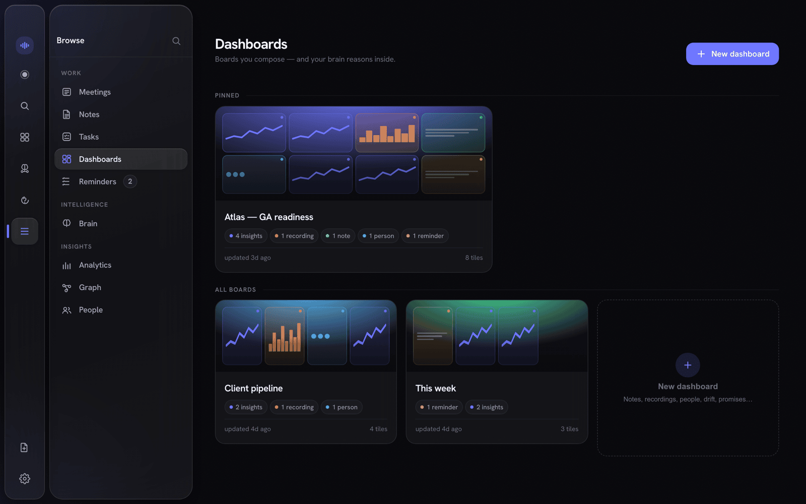
  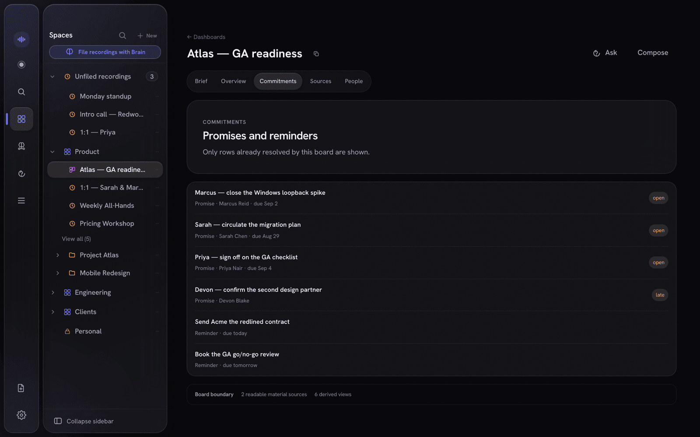
  <br/><em>Left: the boards list. Right: the <b>Commitments</b> lens — every promise and reminder this
  board can resolve, and only those.</em>
</p>

### 📥 Imports — bring the notes you already have

<p align="center">
  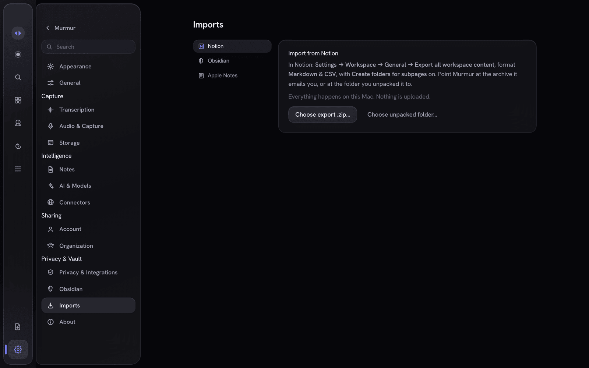
  <br/><em>Three sources, zero network. "Everything happens on this Mac. Nothing is uploaded."</em>
</p>

- **Three sources** — a **Notion export** (`.zip` or an unpacked folder), an **Obsidian vault**, or
  **Apple Notes** (`ImportSource` in `src-tauri/src/import/mod.rs`; an unknown value fails closed rather
  than defaulting to one).
- **Entirely offline.** No account, no key, no network call. Apple Notes asks macOS for permission the
  first time.
- **Dry run first.** Every import reports what it *would* write — new versus already imported — before
  anything is written, and an unfiled import lands in its own named, badged container.
- **Imported notes join the same brain**: chunked, indexed, `[[link]]`-able, and gated by the same
  per-Space lock as everything else.

### ✅ Tasks & reminders

<p align="center">
  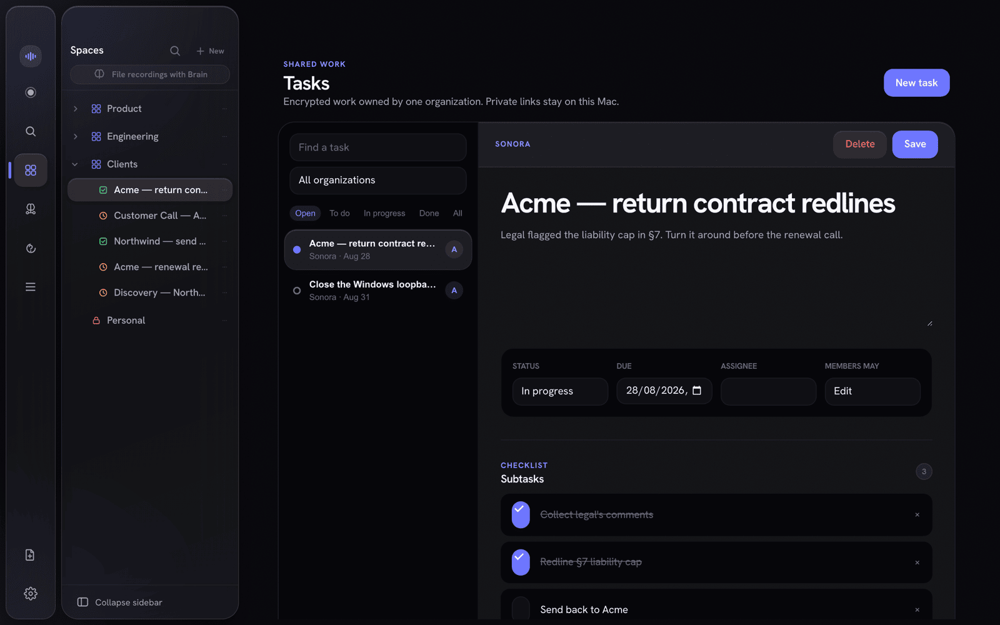
  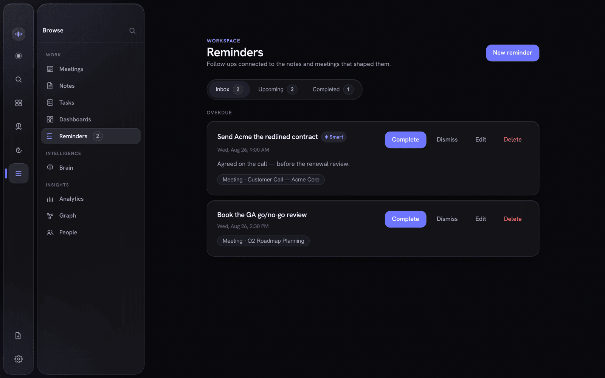
  <br/><em>Left: <b>Tasks</b> — shared work owned by one organization (assignees, due dates, subtasks,
  per-document permissions). Right: <b>Reminders</b> — private to this Mac, each one linked back to the
  recording or note that produced it.</em>
</p>

- **Tasks belong to an org**, so they need a signed-in account — they are the one collaborative surface
  here. Everything else on this page works with no account at all.
- **Reminders are local.** They carry their source, so a follow-up always says which meeting or note it
  came from, and the brain can propose them from a transcript for you to accept or dismiss.

---

## 📝 Notes

A full standalone Markdown note-taking product that lives next to your meetings — not a byproduct of
recording. Same store, same lock model, same brain.

<p align="center">
  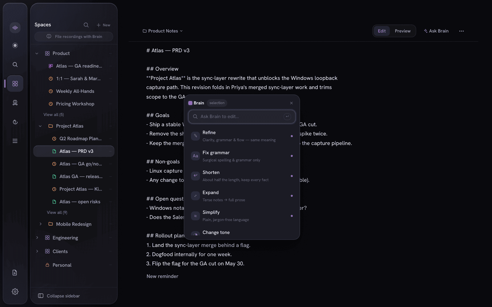
  <br/><em>Select any passage and the Brain menu appears — 19 actions, or type what you want done.</em>
</p>

<p align="center">
  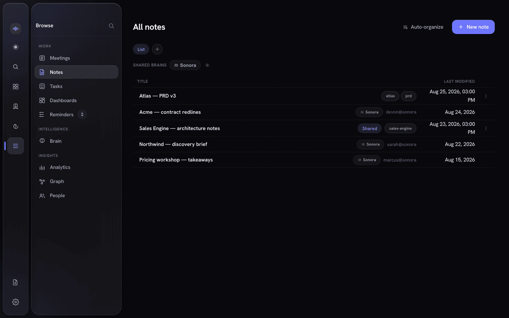
  <br/><em>Every note, with its tags, its sharing state, and the Shared Brains it appears in.</em>
</p>

- **A real editor** at its own route, with collapsible YAML front-matter, a formatting toolbar, markdown
  keyboard shortcuts, an 11-type slash-`/` block-insert menu, Edit/Preview toggle, and debounced
  autosave.
- **Filed in Spaces alongside your recordings** — one hierarchy, not a separate note-folder tree.
  It reuses the exact same **Touch-ID-gated per-container lock**: a locked container masks its notes'
  titles to `🔒 Locked` and blanks body, tags, and properties, just like a locked meeting.
- **AI auto-organize** — the brain proposes a folder/tag reorganization plan, you review it, nothing
  moves until you approve.
- **A 19-action AI command menu on selected text** — grouped into Edit / Structure / From
  your brain / Extract / Create, with a compact 5-action default, tone and translation submenus, and a
  free-text custom instruction. The same command backs all 19 actions, gated on the folder being
  unlocked and routed through the identical provider seam, redaction firewall, and egress ledger as
  meeting summarization — retrieval-only actions never touch the network.
- **Per-note end-to-end-encrypted sharing** — an expiring, optionally password-protected link, or a
  publish into your org's Shared Brain — gated on the folder being unlocked and on explicit share
  consent before anything is ever encrypted and sent.

---

## 🌐 Shared Brain (org)

An opt-in, **free**, end-to-end-encrypted way for your org to build one shared knowledge pool out of
everyone's notes and meetings — without anyone's plaintext ever touching a server.

<p align="center">
  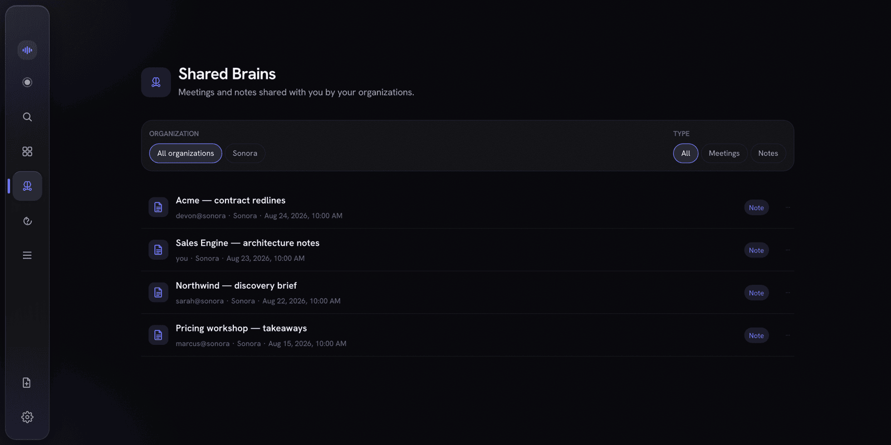
  <br/><em>Everything your organizations have shared with you, filterable by org and by kind.</em>
</p>

- **Free, no seats, no paid tier.** A free account (opt-in login) is all that's required — Shared Brain
  isn't gated behind a plan.
- **Publish a note or a meeting** into your org's shared pool with one click; a preview shows the exact
  outgoing Markdown, its size, and what was scrubbed — before anything leaves your Mac.
- **Zero-knowledge relay.** The backend (`murmur-server`, a separate, Railway-deployed service) stores
  only ciphertext blobs, wrapped per-org content keys, and metadata — never a plaintext field, ever.
- **Verify-before-egress.** Every shared item is sealed, then immediately decrypted back and
  byte-compared *before* it's ever uploaded.
- **Stays fresh automatically.** Editing a note or meeting you've shared re-publishes it (best-effort, on
  save boundaries, never per-keystroke); your own device sees the refresh instantly, teammates pick it
  up on a background sync (about once a minute). No manual "Sync now" needed.
- **Idempotent, dedup'd sharing.** Re-clicking "share" never republishes a duplicate; accidental
  duplicates from earlier versions auto-collapse.
- **Multi-org aware.** Every org you're a member of (owned or invited) is discovered, synced, and
  browsable — not just the first one you joined.
- **Shows up where you'd expect it.** A "Shared brains" section sits alongside your own notes and
  meetings in both Library and the Notes view; your own shares link straight to your editable original,
  teammates' shares open a read-only viewer with the author's current title.
- **Leaving an org purges everything** it ever gave your device — decrypted replica, vectors, search
  index, cached keys.
- **Per-meeting revocation** — the detail view shows any active org shares sourced from a
  meeting and lets you revoke them individually.
- **Per-document permissions** — the document's author sets **View only** or **Can edit** on each
  shared item; the org owner can manage it too.
- **Shared Tasks** — assignees, due dates, subtasks, and the same per-document permissions, scoped to
  one org. Tasks require a signed-in account.
- **Owner-managed membership** — invite by email, remove members, from Settings → Organization.

The wire format (`murmur-protocol`, MIT/Apache) is compiled into both this app and the server, so it's
a real, versioned, backward-compatible envelope — not a bolted-on export format.

---

## 🏗️ Architecture

Murmur is a **Tauri 2.11** desktop app: a **Rust** core (crate `murmur`, lib `meetnotes_lib`, bin `Murmur`)
talks to an **Angular 22 zoneless** frontend over Tauri IPC. There's no NgRx — every screen is a standalone
*signals* component calling a single `IpcService`. The Rust side captures, transcribes, summarizes, and
persists everything to **one SQLCipher-encrypted SQLite database** — the canonical store. Over it sit the
**brain** (a grounded RAG + agentic reasoning layer powering the in-meeting assistant, Ask, and the Notes
AI command menu — full model-driven agentic tool-choice with a provider connection incl. local Ollama, a
grounded retrieval floor on a downloaded on-device model), plus three read surfaces: the app UI, a
read-only **MCP server**, and your exported Markdown vault. Opt in to a free account and a fourth path opens: a
zero-knowledge **sync relay** (`murmur-server`, a separate sibling repo) that lets Shared Brain content —
and nothing else — flow, always as ciphertext, between your org's devices.

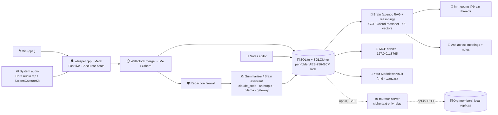
```mermaid
flowchart LR
  mic["🎙️ Mic (cpal)"] --> asr
  sys["🔊 System audio<br/>Core Audio tap / ScreenCaptureKit"] --> asr
  asr["🗣️ whisper.cpp · Metal<br/>Fast live + Accurate batch"] --> merge
  merge["⏱️ Wall-clock merge → Me / Others"] --> db
  merge --> redact
  notes["📝 Notes editor"] --> db
  redact["🛡️ Redaction firewall"] --> prov
  prov["✍️ Summarizer / Brain assistant<br/>claude_code · anthropic · ollama · gateway"] --> db
  db[("🗄️ SQLite + SQLCipher<br/>per-folder AES-256-GCM lock")]
  db --> brain["🧠 Brain (agentic RAG + reasoning)<br/>GGUF/cloud reasoner · e5 vectors"]
  brain --> live["💬 In-meeting @brain threads"]
  brain --> ask["🔎 Ask across meetings + notes"]
  db --> mcp["🧩 MCP server · 127.0.0.1:8765"]
  db --> vault["📁 Your Markdown vault (.md · .canvas)"]
  db -.opt-in, E2EE.-> relay["☁️ murmur-server<br/>ciphertext-only relay"]
  relay -.opt-in, E2EE.-> orgdb[("🗄️ Org members' local replicas")]
```

**The pipeline, stage by stage:** capture (mic + optional system audio) → resample/segment → transcribe
each stream on-device → merge by wall-clock into Me/Others → persist to the SQLCipher DB → summarize (any
cloud-bound text first passes the redaction firewall) → export the note atomically. Notes follow the same
persist → (optional AI assist, same redaction firewall) → export path without a recording stage. Status
events stream to the UI at each stage. If you opt into Shared Brain, publishing a note or meeting adds one
more stage — seal, verify, upload as ciphertext — never a change to how anything is stored locally.

---

## 🧩 The MCP server

Murmur runs a **read-only [Model Context Protocol](https://modelcontextprotocol.io) server** on
`127.0.0.1:8765` so **Claude Desktop / Claude Code** (or any MCP client) can query your meeting and note
memory **with zero egress** — your notes stay on your Mac, and the client reads them locally.

- **Twenty tools**, covering meetings, documents, the graph and the 2.0 surfaces:
  `search_meetings`, `search_transcript`, `get_meeting`, `get_meeting_chapters`, `get_document`,
  `get_document_outline`, `list_recent_meetings`, `search_semantic`, `get_open_commitments`,
  `get_entity_dossier`, `knowledge_diff`, `list_entities`, `list_note_folders`,
  `list_workspace_hierarchy`, `list_dashboards`, `get_dashboard`, `list_tasks`, `get_task`,
  `org_search` (your Shared Brain, if you've opted in) and `query_database`. The registry is the
  `tools` array in `src-tauri/src/mcp.rs` — count it there rather than trusting this sentence.
- **Same visibility gates as the app** — sealed-and-not-unlocked meetings are **invisible** here too, routed
  through the exact `visibility_clause` the UI uses.
- **Token-protected by default** — a bearer token is **required** unless you turn it off.

```jsonc
// ~/Library/Application Support/Claude/claude_desktop_config.json
{
  "mcpServers": {
    "murmur": { "url": "http://127.0.0.1:8765" }
  }
}
```

The MCP config is shown (with a copy button) in **Settings → Privacy & Integrations**.

---

## 🔒 Privacy & the lock model

Privacy isn't a setting in Murmur — it's the architecture. The brain, transcription, and search are designed
to run **without a network**, and every network path Murmur *does* have is opt-in and named.

<p align="center">
  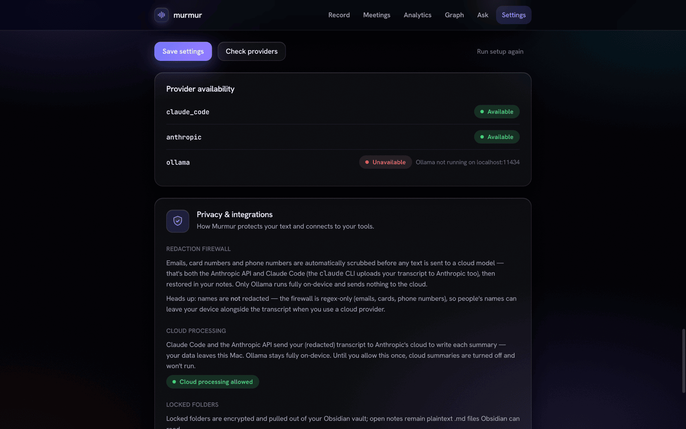
  <br/><em>Murmur tells you, in plain language, exactly what leaves your Mac.</em>
</p>

**What runs where — honestly:**

| Brain / provider | Where it runs | Does meeting/note text leave your Mac? |
| --- | --- | --- |
| **On-device brain** (Bielik / Qwen GGUF) | Fully local | **No.** Grounded reasoning + the in-meeting assistant, on-device. |
| **Ollama** | Fully local | **No.** Nothing leaves the device (loopback only — a remote Ollama host is treated as cloud). |
| **Claude Code** (default summarizer) | Local CLI → Anthropic's cloud | **Yes** — the *redacted* transcript is sent to Anthropic. |
| **Codex** (OpenAI's CLI, run tool-free) | Local CLI → OpenAI's cloud | **Yes** — the *redacted* transcript is sent to OpenAI. |
| **Anthropic API** (BYO key) | Direct HTTPS → Anthropic | **Yes** — the *redacted* transcript is sent to Anthropic. |
| **AI Gateway** (BYO OpenAI-chat-compatible endpoint) | HTTPS → your endpoint | **Yes** — the *redacted* transcript is sent to your endpoint. |

- 🧱 **Two encryption layers at rest.** The **whole** SQLite DB is **SQLCipher**-encrypted (key in the
  macOS Keychain). On top, a **per-folder lock** adds **AES-256-GCM** content keys wrapped by a master
  KEK, released only by a **Touch ID** prompt via the Keychain's own `SecAccessControl` — no app-side
  password, no custom biometric code path.
- 🚪 **Every read is gated.** A sealed-and-not-unlocked meeting or note leaks nothing — across the app,
  search, the graph, MCP, and even the audio asset path. Its title shows as `🔒 Locked`.
- ♻️ **Seals verify-before-destroy.** Murmur proves the ciphertext decrypts *before* it ever blanks the
  plaintext — content is never lost — and re-locking is fully reversible.
- 🛡️ **Redaction firewall.** Emails, card-like numbers, and phone numbers are *always* scrubbed before any
  cloud call; **person-name** redaction kicks in when the on-device NER model is installed. The exact
  same firewall wraps Notes AI actions and Shared Brain publishes.
- ✅ **Cloud egress is fail-closed.** No meeting or note text reaches a cloud provider — or your org's
  Shared Brain — until you grant a one-time, revocable consent per surface. A normal settings save can't
  flip it.
- 📊 **Content-free egress ledger.** A local ledger records *metadata only* — call counts, tokens, bytes,
  and how many PII items were scrubbed — never the text that left.
- 📺 **Screen-share aware.** A best-effort watcher can auto-relock sealed folders and zeroize the cached key
  the moment screen sharing is detected; manual "Lock all" is the authoritative backstop.
- 🌐 **Shared Brain stays zero-knowledge.** The relay never sees plaintext — only sealed, verified
  ciphertext, wrapped keys, and metadata. Leaving an org purges its entire local replica from your Mac.

> ⚠️ **Honest caveat:** Touch ID, lock-at-rest, and screen-share auto-relock only *truly* verify on a
> **Developer-ID-signed build** (the published releases). Development can bypass the Keychain with
> the debug-only `MURMUR_DEV_KEK` hatch; that path is convenient for iteration, not a security guarantee.

---

## 🤖 Providers & the on-device brain

<table>
  <tr>
    <td width="50%">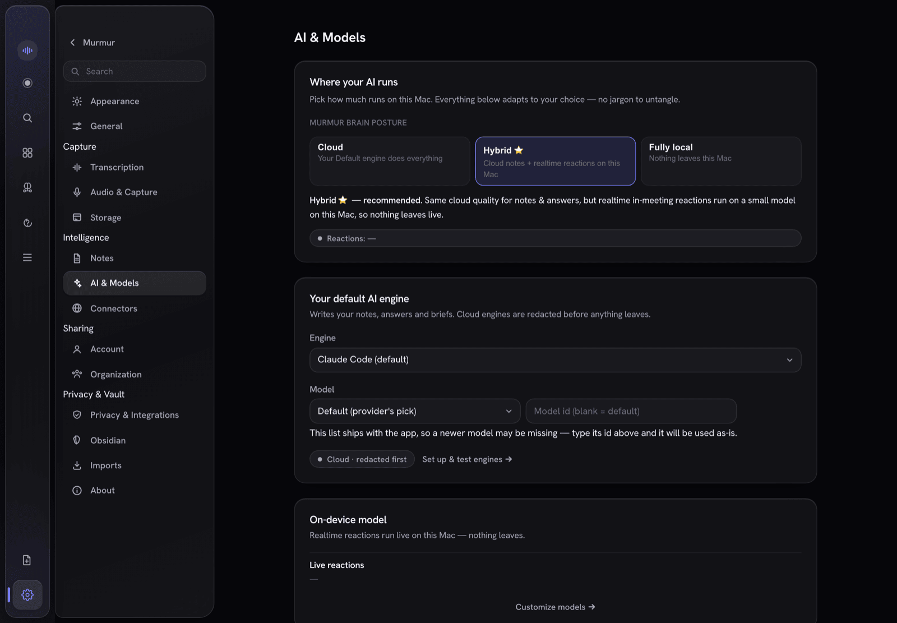</td>
    <td width="50%">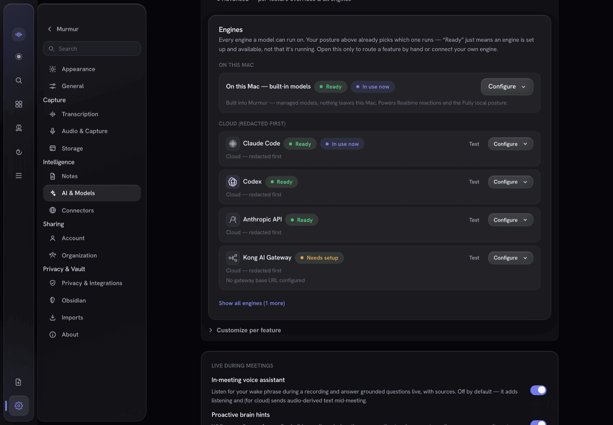</td>
  </tr>
  <tr>
    <td align="center"><em>Pick how much runs on this Mac — the rest of the page adapts to the choice.</em></td>
    <td align="center"><em>Every engine a model can run on, with what leaves the Mac stated per engine.</em></td>
  </tr>
</table>

The **summarizer / brain assistant** is one `SummarizerProvider` trait with five swappable backends —
**`claude_code`** (default), **`codex_cli`** (OpenAI's agent CLI, run as a deliberately tool-free text
transformer: no ambient config, an empty tool registry, and a deny-everything pre-tool hook),
**`anthropic`** (BYO Keychain key), **`ollama`** (local), and a BYO
**OpenAI-chat-compatible gateway** (works with LiteLLM, Portkey, vLLM, LM Studio, and others — the UI
label "Kong AI Gateway" is just a display name for this generic connector, not a Kong partnership). Per-feature
**roles** (Notes / Ask / Live) can each point at a different connection. Separately, the heavy on-device
ML — the **mistralrs** GGUF brain (run as a killable, RAM-reclaiming sidecar process), the **candle** e5
embedder, and the **candle** DeBERTa NER redactor — is **always compiled in** (no cargo feature flags) and
activates at runtime **only when its model files are present**, otherwise degrading to a clean no-op.

- 🧠 **On-device reasoners.** A curated GGUF registry — **Bielik-11B**, **Qwen3-14B**, **Qwen2.5-3B** — runs
  locally via `mistralrs` (Metal), in a separate process the app can fully kill to reclaim RAM on idle,
  timeout, or quit. Download one and the on-device brain activates with grounded, cited answers; nothing
  leaves your Mac. The full model-driven agentic tool-choice runs with a provider connection (including
  local **Ollama**).
- 🌐 **Optional live web** (off by default). A consent-gated **Brave** connector (BYO key) lets the brain
  reach the web when you ask it to; web hits are shown distinctly as "via web", and queries are redacted
  before they leave.

---

## 🛠️ Development

<details>
<summary><b>Toolchain</b></summary>

- **Rust** (`rustup`, toolchain pinned to **1.96.0**) — `curl --proto '=https' --tlsv1.2 -sSf https://sh.rustup.rs | sh -s -- -y`
- **Node** + npm
- **cmake** + **clang / Xcode CLT** — builds `whisper.cpp` and the Metal toolchain (`brew install cmake pkg-config`, `xcode-select --install`)
</details>

```bash
git clone https://github.com/murmur-io/murmur.git && cd murmur
npm install
source ~/.cargo/env

# Dev run. MURMUR_DEV_DEK uses a fixed dev DB key so each rebuild doesn't re-prompt
# the Keychain. No --features needed — the ML/brain stack is always compiled.
MURMUR_DEV_DEK=0123456789abcdef0123456789abcdef0123456789abcdef0123456789abcdef npm run dev
#   → Angular on http://localhost:1420, MCP on 127.0.0.1:8765
```

> A **cold** first build compiles the full `mistralrs` / `candle` ML tree (hundreds of MB) — let it finish;
> the incremental loop is fast once warm.

**Quality gates**

```bash
( cd src-tauri && cargo test --lib )   # fast unit tests (the inner loop)
npx ng lint
npx ng build
bash scripts/ci.sh                      # full gate: clippy -D warnings + tests + lint + build + headless E2E
```

> **Screenshots** in this README are the real Angular UI rendered from the shipping code, populated with a
> privacy-safe demo dataset (no private meetings). Regenerate them with
> [`scripts/screenshots`](scripts/screenshots/README.md).

### 🧱 Tech stack

| Layer | Tech |
| --- | --- |
| **Shell** | Tauri 2.11 · Rust (edition 2021, toolchain 1.96) · macOS-first, universal (arm64 + x86_64), min macOS 13.4 |
| **Frontend** | Angular 22 **zoneless** · standalone + signals · TypeScript · `marked` + `DOMPurify` · **no NgRx** |
| **Audio** | `cpal` · `whisper-rs` (Metal) · Core Audio tap / ScreenCaptureKit · `sherpa-onnx` diarization · optional Parakeet live-ASR · offline + online AEC |
| **On-device brain** | `mistralrs` (GGUF reasoner, killable sidecar) · `candle` (e5 embeddings + DeBERTa NER) · `sqlite-vec` |
| **Storage / crypto** | `rusqlite` + **SQLCipher** · `aes-gcm` + `zeroize` · macOS Keychain `SecAccessControl` (Touch ID) |
| **Sharing backend** | `murmur-server` (sibling repo) — Rust/axum + Postgres, zero-knowledge relay, deployed on Railway; shared `murmur-protocol` wire format compiled into both this app and the server |

### 📂 Project layout

```
murmur/
├─ src/             Angular 22 frontend (standalone, zoneless, signals)
│  └─ app/
│     ├─ core/        ipc.service.ts · models.ts · recorder.store.ts · meeting-conversation.store.ts
│     └─ features/    record · library · detail · folders · graph · ask · brain · notes · org · people ·
│                      briefs · sharing · analytics · settings · onboarding · bar
├─ src-tauri/       Rust core (Tauri 2)
│  └─ src/           commands.rs · pipeline.rs · agent.rs · tools.rs · router.rs · embed/ · mcp.rs · crypto.rs ·
│                      audio/ · transcribe/ · summarize/ · share/ · storage/ · secrets/ · export/
└─ docs/            design notes, research, branding, screenshots
                    (see docs/README.md — it says which of it is current)
```

`../murmur-server/` (a sibling checkout, not part of this repo) holds the accounts + sharing backend —
`crates/murmur-protocol` (the E2EE envelope + wire format, MIT/Apache) and `crates/murmur-server` (the
axum + Postgres relay, AGPL-3.0).

---

## 🗺️ Status

Murmur ships at **v2.0.0** — a signed, notarized macOS app, well past the record →
transcribe → summarize MVP.

**Shipped and in daily use:**
- The full record → transcribe → summarize pipeline, dual-stream capture, the conversation-first record
  screen with in-meeting `@brain` threads, and the floating recorder bar.
- The on-device brain (agentic tool-use loop + hybrid FTS/semantic/entity-graph retrieval), the `/brain`
  knowledge hub, Ask-Your-Vault, and the knowledge graph.
- **Universal document ingest** — drop in a PDF (scanned pages fall back to on-device Apple Vision OCR),
  a Word / PowerPoint / Excel file, an HTML page, Markdown/text, or an image, and it's extracted,
  chunked, and vector-indexed into the same brain, gated by the same per-folder lock.
- **Receipts** — every claim in a generated note that aligns to what was actually said carries a
  receipt chip that jumps you to the exact transcript segment (audio second, speaker, ASR-confidence)
  it came from; unsupported lines earn none, and a sealed meeting leaks no timing or speaker.
- **A self-building link graph** — notes, meetings, *and* imported documents are first-class
  `[[link]]` targets you pick/link/open from any surface; backlinks resolve by id, and the full-brain
  graph renders as a living neural map.
- **Spaces** — one hierarchy for everything. The separate Meetings and Notes folder trees are gone;
  there is a single tree of **Spaces › folders › your recordings and notes**, behind a rebuilt shell
  (a persistent icon rail plus a contextual panel). Locking a Space seals everything inside it.
- **Dashboards** — compose a board from your notes, recordings, documents, people, promise ledgers
  and reminders, plus pinned **living answers** (a question whose answer the app keeps up to date, and
  withholds the moment its sources stop being readable). Read a board through **Brief / Overview /
  Commitments / Sources / People** lenses, or ask it directly, grounded only in what's on it.
- **Imports** — Settings → Imports pulls in a **Notion export**, an **Obsidian vault**, or **Apple
  Notes**. Entirely offline: no API token, no account, no network call. Every import is a dry run
  first, reporting what it would write (new vs. already imported) before anything is written. Apple
  Notes asks macOS for permission on the first run.
- **Ask remembers** — vault, note and meeting conversations persist, each surface with its own history
  browser. A conversation disappears the instant any folder it drew on stops being readable.
- **One model picker** across every AI surface, always accepting a free-text model id — so a model
  released after this build is still selectable.
- **Notes** as a full standalone product — editor, the shared Space/folder lock lifecycle, AI
  auto-organize, and the 19-action AI command menu.
- **Shared Brain** — free, opt-in, end-to-end-encrypted org sharing of notes and meetings, multi-org
  aware, auto-refreshing, with its own MCP tool, and **per-document permissions** (**View only** /
  **Can edit**, set by the document's author).
- **Tasks** — shared work inside a Shared Brain org: assignees, due dates, subtasks, and the same
  per-document permissions. Tasks belong to an org, so — like Shared Brain and link sharing — they
  require a signed-in account. Everything else in this list works with no account at all.
- The per-Space / per-folder Touch ID lock model (two encryption layers, gated reads,
  verify-before-destroy seals), the content-free egress ledger, and the read-only MCP server.
- Per-note and per-meeting expiring E2EE link sharing.

**Honest gaps, not yet shipped or only partially proven:**
- A retrieval router module exists in code but is explicitly shadow-mode — not yet wired into live
  dispatch. Treat it as internal plumbing, not a user-facing capability.
- The on-device reranker seam is wired but currently measured to add no retrieval-quality lift yet.
- Cloud transcription is **not** a shipped path — all transcription today is on-device
  (`whisper.cpp` / optional Parakeet); a cloud-ASR option exists only as a research note, not code.
- Live ScreenCaptureKit / Core Audio tap capture, the Touch ID prompt, and screen-share auto-relock can
  only be *fully* exercised on a signed build on a real Mac, and are documented as such rather than
  claimed from unit tests alone.
- A live, two-account, signed-build round-trip of Shared Brain sharing is still validated manually per
  release rather than by an automated headless test.

## 📄 License

Murmur is open source under the [GNU AGPL-3.0](LICENSE) license.

---

<p align="center"><sub>🍎 macOS-first · 🧠 on-device brain · 🔒 local-first · 🧩 MCP-native · built with Tauri + Angular + Rust</sub></p>
