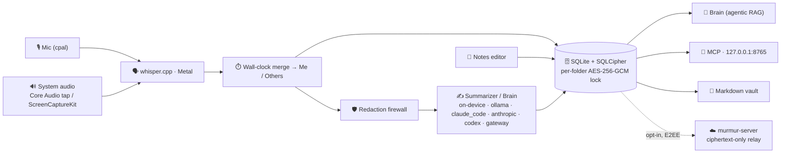

<p align="center">
  
</p>

<h1 align="center">Murmur</h1>

<p align="center">
  <b>A local-first macOS app that records your meetings, transcribes & reasons over them <i>entirely on your Mac</i>,<br/>
  and gives you an AI you can <i>talk to live, in the meeting</i> — and across everything you've ever recorded and written.</b>
</p>

<p align="center">
  
  
  
  
  <a href="LICENSE"></a>
</p>

<p align="center">
  <a href="https://github.com/murmur-io/murmur/releases/latest"><b>⬇️ Download</b></a> ·
  <a href="https://murmurnotes.io"><b>🌐 murmurnotes.io</b></a> ·
  <a href="https://murmurnotes.io/docs.html"><b>📖 Docs</b></a> ·
  <a href="#-development">🛠️ Build from source</a>
</p>

<p align="center">
  <a href="https://murmurnotes.io/#product"></a>
  <br/><a href="https://murmurnotes.io/#product"><b>▶︎ Watch the 90-second tour</b></a>
</p>

---

Most meeting tools just transcribe and ship your audio to someone else's cloud. **Murmur gives your
meetings a brain — and keeps it on your Mac.** Mid-call, type `@brain` + a question and get a grounded
answer with sources from everything you've recorded before, without pausing the recording. After the
call it writes a structured note you own as plain Markdown. With the on-device model or local Ollama,
**none of it leaves the device.**

- 🧠 **A brain you can talk to, mid-meeting** — grounded, cited answers; it proposes, you accept.
- 🎧 **Hears the whole call** — mic and system audio transcribed separately into a **Me / Others** transcript by on-device Whisper.
- 🔎 **Ask across every meeting and note** — hybrid keyword + semantic + entity-graph retrieval, every claim linked to its source.
- 🗂️ **Workspaces, boards, imports** — one hierarchy for recordings and notes, dashboards with living answers, Notion / Obsidian / Apple Notes import.
- 🔒 **Privacy is the architecture** — SQLCipher DB + Touch-ID-gated per-workspace lock, a redaction firewall, fail-closed cloud consent.
- 🧩 **One store, three surfaces** — the app, a read-only local **MCP server**, and your Markdown files.
- 🌐 **Shared Brain** — opt-in, free, end-to-end-encrypted org sharing; the server only ever sees ciphertext.

**→ The full tour, screenshots and pricing live on [murmurnotes.io](https://murmurnotes.io).**

## 🚀 Quick start

Requires **macOS 13.4+** (Apple Silicon or Intel).
[Download the latest signed & notarized build](https://github.com/murmur-io/murmur/releases/latest),
drag `Murmur.app` to Applications, and open it. A first-run wizard walks you through the Whisper model,
an AI provider and (optionally) a Markdown vault folder. Next: [Your first recording](https://murmurnotes.io/docs.html#first-recording).

## 📖 Documentation

Everything user-facing lives in the [docs on murmurnotes.io](https://murmurnotes.io/docs.html):

| Topic | Docs |
| --- | --- |
| Organizing | [Workspaces](https://murmurnotes.io/docs.html#spaces) · [Dashboards](https://murmurnotes.io/docs.html#dashboards) · [Imports](https://murmurnotes.io/docs.html#imports) · [Tasks & reminders](https://murmurnotes.io/docs.html#tasks) |
| Core | [Capture & transcription](https://murmurnotes.io/docs.html#capture) · [The on-device brain](https://murmurnotes.io/docs.html#brain) · [What the Brain can do](https://murmurnotes.io/docs.html#brain-capabilities) · [Receipts](https://murmurnotes.io/docs.html#receipts) · [Notes & the Brain menu](https://murmurnotes.io/docs.html#notes-editor) |
| Collaboration | [Shared Brain](https://murmurnotes.io/docs.html#shared-brain) |
| Integrations | [AI providers](https://murmurnotes.io/docs.html#providers) · [Obsidian, MCP, Reminders & file ingestion](https://murmurnotes.io/docs.html#integrations-apps) |
| Configuration | [Settings](https://murmurnotes.io/docs.html#settings) · [Keyboard shortcuts](https://murmurnotes.io/docs.html#shortcuts) · [Diagnostics](https://murmurnotes.io/docs.html#diagnostics) |
| Privacy & security | [What never leaves your Mac](https://murmurnotes.io/docs.html#data-flow) · [The lock model](https://murmurnotes.io/docs.html#lock-model) · [Redaction firewall](https://murmurnotes.io/docs.html#redaction-firewall) · [Known limitations](https://murmurnotes.io/docs.html#known-limitations) |

The engineering record of what has shipped, and what a headless machine cannot prove, is
[`docs/STATUS.md`](docs/STATUS.md).

## 🏗️ Architecture

A **Tauri 2** desktop app: a **Rust** core (crate `murmur`, lib `meetnotes_lib`) talks to an
**Angular 22 zoneless** frontend (standalone + signals, no NgRx) over Tauri IPC. **One SQLCipher-encrypted
SQLite database** is the canonical store; the brain, the MCP server and the Markdown vault are readers
over it. The opt-in sharing relay lives in a separate repo, [`murmur-server`](https://github.com/murmur-io/murmur-server).



| Layer | Tech |
| --- | --- |
| **Shell** | Tauri 2 · Rust (toolchain 1.96) · universal (arm64 + x86_64), min macOS 13.4 |
| **Frontend** | Angular 22 zoneless · standalone + signals · `marked` + `DOMPurify` |
| **Audio** | `cpal` · `whisper-rs` (Metal) · Core Audio tap / ScreenCaptureKit · `sherpa-onnx` diarization |
| **On-device brain** | `mistralrs` (GGUF, killable sidecar) · `candle` (e5 embeddings + DeBERTa NER) · `sqlite-vec` |
| **Storage / crypto** | `rusqlite` + SQLCipher · `aes-gcm` + `zeroize` · Keychain `SecAccessControl` (Touch ID) |

## 🛠️ Development

Toolchain: **Rust** via `rustup` (pinned 1.96), **Node ≥ 24.15** + npm, **cmake** + Xcode Command Line
Tools (`brew install cmake pkg-config`, `xcode-select --install`).

```bash
git clone https://github.com/murmur-io/murmur.git && cd murmur
npm install
source ~/.cargo/env

# MURMUR_DEV_DEK = a fixed dev DB key, so each rebuild doesn't re-prompt the Keychain.
MURMUR_DEV_DEK=0123456789abcdef0123456789abcdef0123456789abcdef0123456789abcdef npm run dev
#   → Angular on http://localhost:1420, MCP on 127.0.0.1:8765
```

A **cold** first build compiles the full `mistralrs` / `candle` ML tree (hundreds of MB) — let it
finish; the incremental loop is fast once warm.

```bash
( cd src-tauri && cargo test --lib )   # fast unit tests (the inner loop)
npx ng lint && npx ng build
bash scripts/ci.sh                      # full gate: clippy -D warnings + tests + lint + build + headless E2E
```

```
murmur/
├─ src/          Angular frontend (app/core · app/features · app/design-system · design-tokens)
├─ src-tauri/    Rust core (commands · storage · audio · transcribe · summarize · mcp · crypto · secrets · export)
├─ landing/      murmurnotes.io — the landing page and user docs (auto-deployed)
└─ docs/         status, design notes, research, screenshots (see docs/README.md for what's current)
```

Screenshots are the real Angular UI rendered over a privacy-safe demo dataset — regenerate them with
[`scripts/screenshots`](scripts/screenshots/README.md). Contributor rules for agents and humans live in
[`CLAUDE.md`](CLAUDE.md) and [`.claude/rules/`](.claude/rules).

## 📄 License

Murmur is open source under the [GNU AGPL-3.0](LICENSE). The shared wire format
(`murmur-protocol`, in `murmur-server`) is MIT/Apache-2.0.
