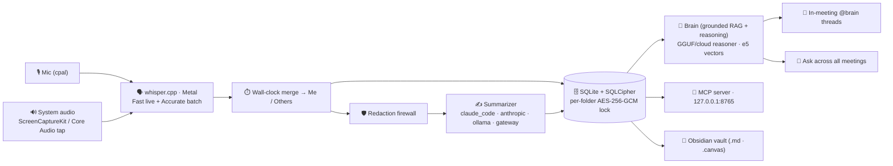

<p align="center">
  
</p>

<h1 align="center">Murmur</h1>

<p align="center">
  <b>A local-first macOS app that records your meetings, transcribes & reasons over them <i>entirely on your Mac</i>,<br/>
  and gives you an AI you can <i>talk to live, in the meeting</i> — and across everything you've ever recorded.</b>
</p>

<p align="center">
  
  
  
  
  
  
  
  <a href="LICENSE"></a>
</p>

<p align="center">
  <a href="https://github.com/murmur-io/murmur/releases/latest"><b>⬇️ Download</b></a> ·
  <a href="#-quick-start">Quick start</a> ·
  <a href="#-the-brain--your-meeting-memory-you-can-talk-to">The brain</a> ·
  <a href="#-features">Features</a> ·
  <a href="#-architecture">Architecture</a> ·
  <a href="#-the-mcp-server">MCP</a> ·
  <a href="#-privacy--the-lock-model">Privacy</a>
</p>

---

Most meeting tools just transcribe and ship your audio to someone else's cloud. **Murmur gives your
meetings a brain — and keeps it on your Mac.** While you're still in the call you can jot a note, drop
`@brain` in front of a question, and get a **grounded answer with sources** drawn from everything
you've recorded before — the recording never stops. After the call it writes a clean structured note
and remembers it forever: searchable, linkable, and queryable by your own AI. With Ollama or the
bundled on-device model, **none of it ever leaves the device.**

> 🎙️ **Record** → 🧠 **transcribe & reason on-device** → 💬 **ask your brain — live in the meeting** →
> 🔎 **and across your whole history.** _(And yes — every note is plain Markdown you own.)_

<p align="center">
  
  <br/><em>Mid-meeting: take notes as you go, type <code>@brain</code> + a question to open a thread, and the
  on-device brain answers — <b>grounded, with sources</b> — without ever pausing the recording.</em>
</p>

## ✨ Why Murmur is different

- 🧠 **A brain you can talk to — mid-meeting.** Type `@brain` in your notes (or tap the mic) and the
  on-device assistant answers out of your meeting history, **live, with citations**, in a Slack-style
  thread — while the recording keeps rolling.
- 🤝 **The agent proposes, you accept.** The brain never writes to your notes on its own. When it drafts
  something useful it offers a quiet **"✓ Add to notes"** — nothing enters your notes unless you say so.
- 🔒 **Truly local-first.** The brain, transcription, and search all run on your Mac. Pick a fully-local
  stack (Ollama or the bundled GGUF model) and **nothing ever leaves the device.**
- 🔎 **Memory across every meeting.** Ask one question and get an answer synthesized from months of calls,
  each claim linked back to the meeting it came from.
- 🎧 **It hears the whole call.** Your mic *and* the other side's system audio are captured and transcribed
  separately, then merged into a **Me / Others** transcript.
- 🧩 **One store, three surfaces.** An encrypted SQLite DB is the single source of truth; the app, a
  read-only **MCP server**, and your Obsidian vault are thin readers — never diverging copies.
- 📁 **You own the output.** Notes are plain Markdown (and Obsidian-friendly) — no proprietary format, no lock-in.
- 🪟 **A Liquid Glass shell (macOS 26).** Floating glass rails that collapse into an Apple TV-style pill bar,
  a **⌘K** spotlight over your whole vault, **⌘N** for a new note, light/dark, and a transparency slider that
  honors macOS "Reduce transparency".

---

## 🚀 Quick start

> **Requires macOS 13.4+ (Apple Silicon or Intel).**

**Just want to use it?** → [**Download the latest signed & notarized build**](https://github.com/murmur-io/murmur/releases/latest),
drag `Murmur.app` to Applications, and open it. A first-run wizard walks you through the Whisper model,
an AI provider, and (optionally) an Obsidian vault.

<p align="center">
  
</p>

To run the in-meeting brain fully offline, download an on-device model (Bielik / Qwen) and turn on
**realtime reactions** in Settings — it gives grounded, cited answers on device. The full model-driven
**agentic loop** (the brain chooses which tools to call) runs with a **provider connection** — including
local **Ollama** — while a downloaded on-device model uses a grounded retrieval floor. See
[Providers & the on-device brain](#-providers--the-on-device-brain).
Building from source? Jump to [Development](#-development).

---

## 🧠 The brain — your meeting memory you can talk to

This is the part most note-takers don't have. Murmur treats **everything you record as one brain**:
your transcripts and notes are the memory, an on-device (or cloud) model is the reasoning, and internal
retrieval + consent-gated connectors are the tools. You talk to it live in the meeting, ask it across
your whole history, and browse what it knows — all over the same store.

### 💬 Live, in the meeting

<p align="center">
  
</p>

- **Notes-first, thread-native.** The record screen is a calm notes surface. Jot as you go; drop a
  standalone **`@brain`** to open an anchored, multi-turn **thread** where the assistant answers — the
  recording bar stays out of the way at the top.
- **Voice *or* text, one loop.** Ask by voice (wake phrase or a single **Ask AI** click, click-to-stop
  so it catches your whole question) or by typing `@brain` — both funnel through the **same brain**. With a
  **provider connection** (including local **Ollama**) it's a model-driven **agentic loop** that decides
  which gated tools to call, with a live tool-trace ("Searching notes… ✓"); a downloaded on-device model
  answers from a grounded retrieval floor instead.
- **Grounded, not hallucinated.** Every answer is retrieved from your own transcripts and notes first,
  then summarized — with the source meetings cited as chips you can open.
- **✨ Ask brain on any note.** Hover a note and hit **✨ ask brain** to open a thread seeded from that
  line — the note stays a note; the thread just hangs under it.

### 🗂️ The `/brain` hub — what it knows

<p align="center">
  
  <br/><em>Everything the assistant can reason over, in one place — meetings, imported documents, and typed notes.</em>
</p>

- **One page for your whole brain.** A status header counts your (visible) **meetings**, **documents**,
  and **notes**, shows whether semantic search is on, and links straight to Ask.
- **Expand it with your own sources.** Drop in Markdown/text **documents**, or paste a quick **note** —
  each is chunked and (when the on-device embedding model is present) vector-indexed into the same brain,
  gated by the same per-folder lock.
- **See the connections.** A collapsible graph shows how people and projects link across everything.

### 🔎 Ask across every meeting

<p align="center">
  
  <br/><em>Ask Your Vault — one question, answered across months of meetings, every claim linked to its source.</em>
</p>

- **Ask Your Vault** — full-page grounded chat across all your (visible) meetings, answered by the same
  agentic loop, every answer linked back to the meetings it came from. Single-meeting chat cites
  time-indexed transcript segments.
- **Hybrid retrieval** — keyword search (FTS) fused with on-device **semantic vectors**
  (`multilingual-e5-small`, 384-dim, `sqlite-vec` KNN, Reciprocal Rank Fusion). On device and **on by
  default**; it downloads a ~470 MB on-device embedding model from Settings to activate, and falls back to
  keyword search until then.
- **Related meetings** (semantic neighbors) and **entity dossiers** that synthesize a person or project
  across everything they touched.

<p align="center">
  
  <br/><em>People & Projects, extracted automatically and counted — sealed folders stay hidden.</em>
</p>

---

## 🧭 Features

### 🎙️ Capture & transcribe

<p align="center">
  
</p>

- **Dual-stream recording** — microphone (`cpal`) **plus** the other side's system audio (a Swift
  **ScreenCaptureKit** sidecar, or a **Core Audio process tap** on macOS 14.4+), transcribed independently
  and merged by host wall-clock into **Me / Others**.
- **On-device Whisper** (`whisper.cpp` via `whisper-rs`, **Metal**). A *Fast* pass drives ~3-second live
  captions while you record; an *Accurate* beam-search pass (anti-hallucination gates) runs once after you stop.
- **Live captions are mic-only until you stop.** During the call, the live captions (and the live `@brain`
  context) transcribe *your* microphone; the other side's system audio is captured in parallel and folded
  into the full **Me / Others** transcript only after you stop.
- **Best-effort extras, graceful by default** — Silero **VAD**, optional **speaker diarization** of the
  others stream, **offline echo cancellation**, and opt-in hi-fidelity native-rate masters; each degrades
  cleanly when its model is absent.
- **Guardrails** — a 4-hour cap, live mic-mute that preserves sync, an input-device picker, and detection
  of a running meeting app (Zoom / Teams / Webex). Whisper sizes `tiny`…`large-v3` (**default `small`**,
  ~470 MB — a RAM-safe default; all sizes stay selectable) download once from Settings.

<p align="center">
  
  <br/><em>The signature floating recorder bar (<code>⌘⇧R</code>) — record (and ask) from anywhere.</em>
</p>

### 📝 Notes & structure

<table>
  <tr>
    <td width="50%"></td>
    <td width="50%"></td>
  </tr>
  <tr>
    <td align="center"><em>A structured note — summary, decisions, action items, quotes.</em></td>
    <td align="center"><em>The merged <b>Me / Others</b> transcript, time-indexed.</em></td>
  </tr>
</table>

- **Structured notes** generated from the transcript: summary, decisions, action items, and notable quotes —
  re-summarize any meeting with a different model.
- **Recipes** turn a transcript into emails, decision logs, or action lists; action items can push to **Apple Reminders**.
- **Timeline & more** — an interactive **speaker + topic timeline**, pin-a-moment block refs, weekly
  **digests**, and deterministic cross-meeting **Topic Threads**. Your on-device macOS **calendar**
  (EventKit, zero-OAuth) is reachable on demand as the brain's `calendar_lookup` tool when you ask in
  Ask / `@brain` (e.g. "who's in my next meeting?") — there is no standalone proactive brief screen.

<p align="center">
  
</p>

<table>
  <tr>
    <td width="50%"></td>
    <td width="50%"></td>
  </tr>
  <tr>
    <td align="center"><em>Library — folders, tags, and lock-aware rows (🔒 sealed folders).</em></td>
    <td align="center"><em>Totals, a 30-day activity chart, and a status breakdown.</em></td>
  </tr>
</table>

### 📁 Yours to keep

A nice-to-have, not a lock-in: every note is also exported as plain **Obsidian Markdown** — atomic `.md`
with YAML front-matter, `[[wikilinks]]`, `obsidian://` deep-links, and a `.canvas` board option. People and
projects mirror into vault stub notes, so your Obsidian graph builds itself. Don't use Obsidian? The files
are still just Markdown you own. (The encrypted SQLite DB — not the vault — is the source of truth.)

---

## 🏗️ Architecture

Murmur is a **Tauri 2.11** desktop app: a **Rust** core (crate `murmur`, lib `meetnotes_lib`, bin `Murmur`)
talks to an **Angular 22 zoneless** frontend over Tauri IPC. There's no NgRx — every screen is a standalone
*signals* component calling a single `IpcService`. The Rust side captures, transcribes, summarizes, and
persists everything to **one SQLCipher-encrypted SQLite database** — the canonical store. Over it sit the
**brain** (a grounded RAG + reasoning layer powering the in-meeting assistant and Ask — full model-driven
agentic tool-choice with a provider connection incl. local Ollama, a grounded retrieval floor on a
downloaded on-device model), plus three read surfaces: the app UI, a read-only **MCP server**, and your
Obsidian vault.



**The pipeline, stage by stage:** capture (mic + optional system audio) → resample/segment → transcribe
each stream on-device → merge by wall-clock into Me/Others → persist to the SQLCipher DB → summarize (any
cloud-bound text first passes the redaction firewall) → export the note atomically. Status events stream to
the UI at each stage.

---

## 🧩 The MCP server

Murmur runs a **read-only [Model Context Protocol](https://modelcontextprotocol.io) server** on
`127.0.0.1:8765` so **Claude Desktop / Claude Code** (or any MCP client) can query your meeting memory
**with zero egress** — your notes stay on your Mac, and the client reads them locally.

- **Six tools** — `search_meetings`, `get_meeting`, `list_recent_meetings`, `search_semantic`,
  `get_open_commitments`, `get_entity_dossier`.
- **Same visibility gates as the app** — sealed-and-not-unlocked meetings are **invisible** here too, routed
  through the exact `visibility_clause` the UI uses.
- **Token-protected by default** — a bearer token is **required** unless you turn it off.

```jsonc
// ~/Library/Application Support/Claude/claude_desktop_config.json
{
  "mcpServers": {
    "murmur": { "url": "http://127.0.0.1:8765" }
  }
}
```

The MCP config is shown (with a copy button) in **Settings → Privacy & Integrations**.

---

## 🔒 Privacy & the lock model

Privacy isn't a setting in Murmur — it's the architecture. The brain, transcription, and search are designed
to run **without a network**.

<p align="center">
  
  <br/><em>Murmur tells you, in plain language, exactly what leaves your Mac.</em>
</p>

**What runs where — honestly:**

| Brain / provider | Where it runs | Does meeting text leave your Mac? |
| --- | --- | --- |
| **On-device brain** (Bielik / Qwen GGUF) | Fully local | **No.** Grounded reasoning + the in-meeting assistant, on-device. |
| **Ollama** | Fully local | **No.** Nothing leaves the device. |
| **Claude Code** (default summarizer) | Local CLI → Anthropic's cloud | **Yes** — the *redacted* transcript is sent to Anthropic. |
| **Anthropic API** (BYO key) | Direct HTTPS → Anthropic | **Yes** — the *redacted* transcript is sent to Anthropic. |
| **AI Gateway** (BYO OpenAI-compatible) | HTTPS → your gateway | **Yes** — the *redacted* transcript is sent to your endpoint. |

- 🧱 **Two encryption layers at rest.** The **whole** SQLite DB is **SQLCipher**-encrypted (key in the
  macOS Keychain). On top, a **per-folder lock** adds **AES-256-GCM** content keys wrapped by a master KEK
  released only by a **Touch ID** prompt — no app-side password.
- 🚪 **Every read is gated.** A sealed-and-not-unlocked meeting leaks nothing — across the app, search, the
  graph, MCP, and even the audio asset path. Its title shows as `🔒 Locked`.
- ♻️ **Seals verify-before-destroy.** Murmur proves the ciphertext decrypts *before* it ever blanks the
  plaintext — content is never lost — and re-locking is fully reversible.
- 🛡️ **Redaction firewall.** Emails, card-like numbers, and phone numbers are *always* scrubbed before any
  cloud call; **person-name** redaction kicks in when the on-device NER model is installed.
- ✅ **Cloud egress is fail-closed.** No meeting text reaches a cloud provider until you grant a one-time,
  revocable consent — a flag a normal settings save can't flip.
- 📊 **Content-free egress ledger.** A local ledger records *metadata only* — call counts, tokens, and how
  many PII items were scrubbed — never the text that left.
- 📺 **Screen-share aware.** A best-effort watcher can auto-relock sealed folders and zeroize the cached key
  the moment screen sharing is detected.

> ⚠️ **Honest caveat:** Touch ID, lock-at-rest, and screen-share auto-relock only *truly* verify on a
> **Developer-ID-signed build** (the published releases). An unsigned local dev build degrades biometrics to
> a permissive stub — handy for development, not a security guarantee.

---

## 🤖 Providers & the on-device brain

<table>
  <tr>
    <td width="50%"></td>
    <td width="50%"></td>
  </tr>
  <tr>
    <td align="center"><em>One provider seam — set a connection up once, then pick per feature.</em></td>
    <td align="center"><em>The on-device brain registry + on-device intelligence toggles.</em></td>
  </tr>
</table>

The **summarizer** is one `SummarizerProvider` trait with swappable backends — **`claude_code`**
(default), **`anthropic`** (BYO Keychain key), **`ollama`** (local), and a BYO **OpenAI-compatible gateway**
(LiteLLM / Kong / Portkey / vLLM). Per-feature **roles** (Notes / Ask / Live) can each point at a different
connection. Separately, the heavy on-device ML — the **mistralrs** GGUF brain, the **candle** e5 embedder,
and the **candle** DeBERTa NER redactor — is **always compiled in** (no cargo feature flags) and activates at
runtime **only when its model files are present**, otherwise degrading to a clean no-op.

- 🧠 **On-device reasoners.** A curated GGUF registry — **Bielik-11B**, **Qwen3-14B**, **Qwen2.5-3B** — runs
  locally via `mistralrs` (Metal). Download one and the on-device brain activates with grounded, cited
  answers; nothing leaves your Mac. The full model-driven agentic tool-choice runs with a provider
  connection (including local **Ollama**).
- 🌐 **Optional live web** (off by default). A consent-gated **Brave** connector (BYO key) lets the brain
  reach the web when you ask it to; web hits are shown distinctly as "via web", and queries are redacted
  before they leave.

---

## 🛠️ Development

<details>
<summary><b>Toolchain</b></summary>

- **Rust** (`rustup`, toolchain pinned to **1.96.0**) — `curl --proto '=https' --tlsv1.2 -sSf https://sh.rustup.rs | sh -s -- -y`
- **Node** + npm
- **cmake** + **clang / Xcode CLT** — builds `whisper.cpp` and the Metal toolchain (`brew install cmake pkg-config`, `xcode-select --install`)
</details>

```bash
git clone https://github.com/murmur-io/murmur.git && cd murmur
npm install
source ~/.cargo/env

# Dev run. MURMUR_DEV_DEK uses a fixed dev DB key so each rebuild doesn't re-prompt
# the Keychain. No --features needed — the ML/brain stack is always compiled.
MURMUR_DEV_DEK=0123456789abcdef0123456789abcdef0123456789abcdef0123456789abcdef npm run dev
#   → Angular on http://localhost:1420, MCP on 127.0.0.1:8765
```

> A **cold** first build compiles the full `mistralrs` / `candle` ML tree (hundreds of MB) — let it finish;
> the incremental loop is fast once warm.

**Quality gates**

```bash
( cd src-tauri && cargo test --lib )   # ~128 fast unit tests (the inner loop)
npx ng lint
npx ng build
bash scripts/ci.sh                      # full gate: clippy -D warnings + tests + lint + build + headless E2E
```

> **Screenshots** in this README are the real Angular UI rendered from the shipping code, populated with a
> privacy-safe demo dataset (no private meetings). Regenerate them with
> [`scripts/screenshots`](scripts/screenshots/README.md).

### 🧱 Tech stack

| Layer | Tech |
| --- | --- |
| **Shell** | Tauri 2.11 · Rust (edition 2021, toolchain 1.96) · macOS-first, universal (arm64 + x86_64), min macOS 13.4 |
| **Frontend** | Angular 22 **zoneless** · standalone + signals · TypeScript 6.0 · `marked` + `DOMPurify` · **no NgRx** |
| **Audio** | `cpal` · `whisper-rs` (Metal) · ScreenCaptureKit / Core Audio tap · `sherpa-onnx` diarization · offline AEC |
| **On-device brain** | `mistralrs` (GGUF reasoner) · `candle` (e5 embeddings + DeBERTa NER) · `sqlite-vec` |
| **Storage / crypto** | `rusqlite` + **SQLCipher** · `aes-gcm` + `zeroize` · macOS Keychain · Touch ID (`LAContext`) |

### 📂 Project layout

```
murmur/
├─ src/             Angular 22 frontend (standalone, zoneless, signals)
│  └─ app/
│     ├─ core/        ipc.service.ts · models.ts · recorder.store.ts · meeting-conversation.store.ts
│     └─ features/    record · library · detail · folders · graph · ask · brain · analytics · settings · onboarding · bar
├─ src-tauri/       Rust core (Tauri 2)
│  └─ src/           commands.rs · pipeline.rs · reason.rs · embed.rs · mcp.rs · crypto.rs · audio/ · transcribe/ · summarize/ · storage/ · secrets/ · export/
└─ docs/            design notes, research, branding, screenshots
```

---

## 🗺️ Status

Murmur ships at **v0.6.4** — a signed, notarized macOS app. The full record → transcribe → summarize
pipeline, the conversation-first record screen with in-meeting `@brain` threads, the on-device brain +
semantic search, the `/brain` knowledge hub, the per-folder Touch ID lock, the knowledge graph,
Ask-Your-Vault, and the MCP server are all implemented. Some capabilities — live ScreenCaptureKit capture,
the Touch ID prompt, and screen-share auto-relock — can only be *fully* exercised on a signed build on a
real Mac, and are documented as such.

## 📄 License

Murmur is open source under the [GNU AGPL-3.0](LICENSE) license.

---

<p align="center"><sub>🍎 macOS-first · 🧠 on-device brain · 🔒 local-first · 🧩 MCP-native · built with Tauri + Angular + Rust</sub></p>
