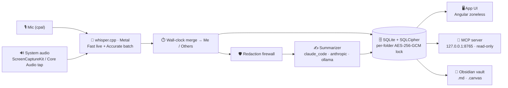
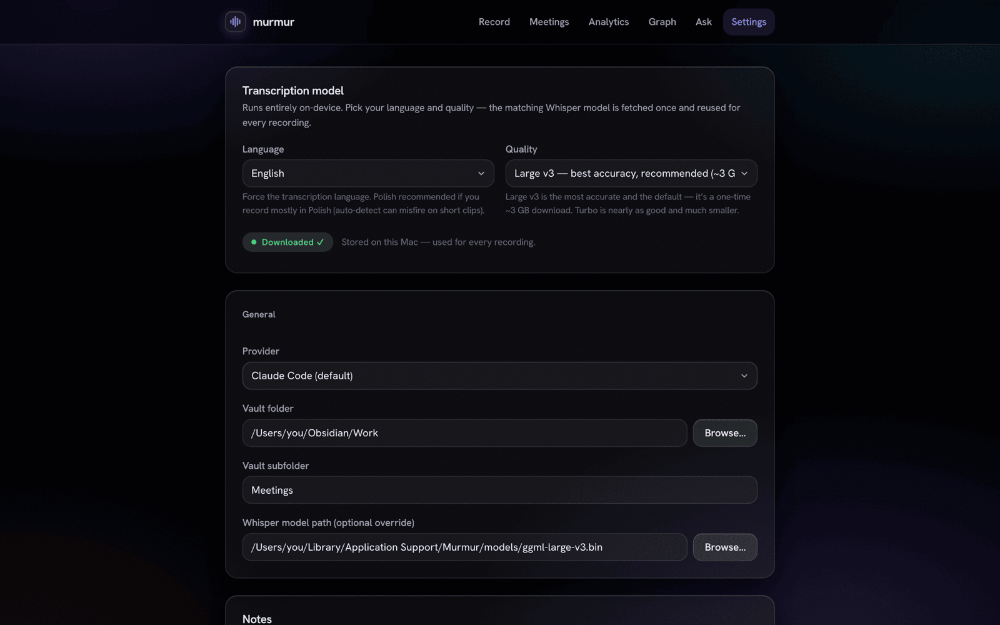
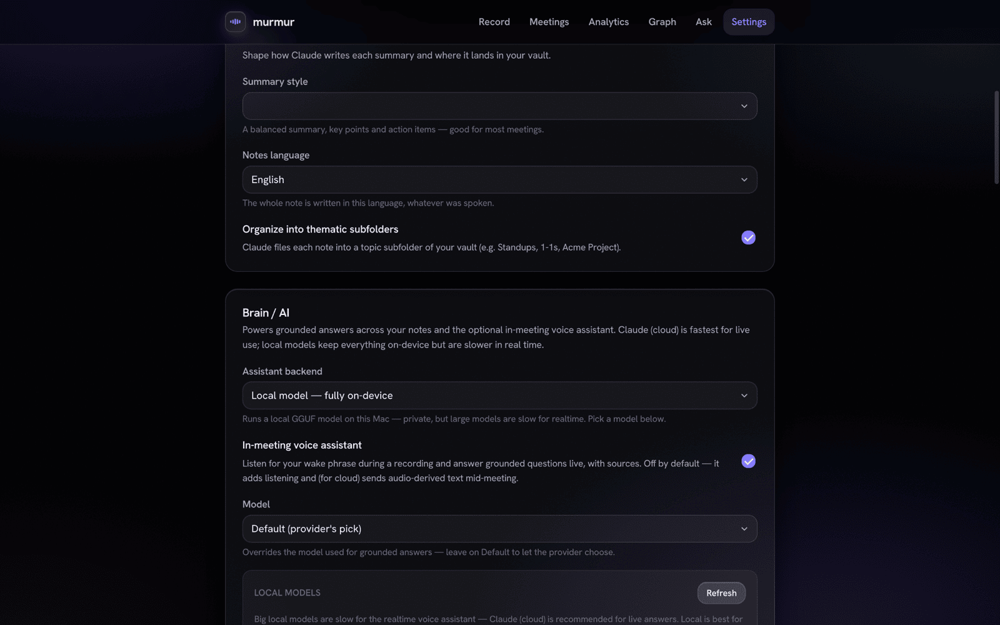

<p align="center">
  
</p>

<h1 align="center">Murmur</h1>

<p align="center">
  <b>A local-first macOS app that records your meetings, transcribes & summarizes them entirely on-device,<br/>and writes the result straight into your Obsidian vault as plain Markdown you own.</b>
</p>

<p align="center">
  
  
  
  
  
  
</p>

<p align="center">
  <a href="https://github.com/JakubGawr/murmur/releases/latest"><b>⬇️ Download the latest release</b></a> ·
  <a href="#-quick-start">Quick start</a> ·
  <a href="#-features">Features</a> ·
  <a href="#%EF%B8%8F-architecture">Architecture</a> ·
  <a href="#-privacy--the-lock-model">Privacy</a>
</p>

---

Most meeting-notes tools ship your audio to someone else's cloud. **Murmur doesn't.** It captures
both sides of the conversation, runs Whisper **on your Mac's GPU**, turns the transcript into a clean
structured note, and drops that note into your **Obsidian vault** as a plain `.md` file — with
front-matter, `[[wikilinks]]`, and `obsidian://` block-refs. The encrypted SQLite database is the
single source of truth; the app, a local MCP server, and your vault are three thin windows onto it.

> 🎙️ **Record** → 🧠 **Transcribe on-device** → ✍️ **Summarize** → 📁 **Own it in Obsidian** — and with
> Ollama or the on-device brain, **nothing ever leaves your machine.**

<p align="center">
  
  <br/><em>Recording in progress — live waveform, an elapsed timer, and ~3-second on-device live captions.</em>
</p>

## ✨ Why Murmur is different

- 🔒 **Truly local-first.** Audio and transcripts stay on the device. Pick a fully-local stack
  (Ollama + on-device Whisper) and **nothing leaves your Mac, ever.**
- 🎧 **It hears the whole call.** Your mic *and* the other side's system audio are captured and
  transcribed separately, then merged by wall-clock into a **Me / Others** transcript.
- 📝 **You own the files.** Output is plain Obsidian Markdown (and `.canvas`) — no proprietary format,
  no lock-in. Delete the app and your notes are still right there in your vault.
- 🧩 **One store, three surfaces.** SQLite is canonical; the UI, a read-only **MCP server**, and your
  Obsidian vault are all just readers — never three diverging copies of the truth.
- 🧠 **On-device intelligence.** Whisper transcription, a local GGUF reasoning brain, semantic vector
  search, and named-entity redaction are all compiled in and light up when their models are present.
- 🛡️ **Privacy you can verify.** A redaction firewall scrubs text before any optional cloud call, and
  sensitive folders can be sealed behind a **Touch ID** lock.

---

## 🚀 Quick start

> **Requires macOS 13.4+ (Apple Silicon or Intel).**

**Just want to use it?** → [**Download the latest signed & notarized build**](https://github.com/JakubGawr/murmur/releases/latest), drag `Murmur.app` to Applications, and open it. A first-run wizard walks you through the Whisper model, an AI provider, and your vault.

<p align="center">
  
</p>

**Build it from source** (see [Development](#-development) for the full toolchain):

```bash
git clone https://github.com/JakubGawr/murmur.git && cd murmur
npm install
source ~/.cargo/env
npm run dev            # Angular dev server on :1420 + the native window; MCP on 127.0.0.1:8765
```

---

## 🧭 Features

### 🎙️ Capture & transcribe

<p align="center">
  
  <br/><em>The signature floating recorder bar (<code>⌘⇧R</code>) — record from anywhere, with a live caption.</em>
</p>

- **Dual-stream recording** — microphone (via `cpal`) **plus** the other side's system audio (a Swift
  **ScreenCaptureKit** sidecar, or a **Core Audio process tap** on macOS 14.4+). The two streams are
  transcribed independently and merged by host wall-clock into **Me / Others**.
- **On-device Whisper** (`whisper.cpp` via `whisper-rs`, **Metal**-accelerated). A *Fast* greedy pass
  drives ~3-second live captions while you record; an *Accurate* beam-search pass (beam 5, temperature
  ladder, anti-hallucination gates) runs once after you stop.
- **Best-effort extras that degrade gracefully** — optional Silero **VAD** pre-segmentation, optional
  **speaker diarization** of the others stream, and opt-in hi-fidelity native-rate master archives.
- **Sensible guardrails** — a hard 4-hour recording cap, live mic-mute that preserves sync, an
  input-device picker, and detection of a running meeting app (Zoom / Teams / Webex).
- **Models on your terms** — Whisper sizes from `tiny` to `large-v3` (default **large-v3**) download
  once from Hugging Face when you ask for them in Settings; language can be forced or auto-detected.

### 📝 Notes, knowledge & Obsidian

<table>
  <tr>
    <td width="50%"></td>
    <td width="50%"></td>
  </tr>
  <tr>
    <td align="center"><em>A structured note — summary, decisions, action items, quotes.</em></td>
    <td align="center"><em>The merged <b>Me / Others</b> transcript, time-indexed.</em></td>
  </tr>
</table>

- **Structured notes** generated from the transcript and exported as **atomic** Obsidian `.md` with YAML
  front-matter, `[[wikilinks]]`, and `obsidian://` deep-links. Re-summarize any meeting with a different model.
- **A self-assembling knowledge graph.** People and projects are extracted and mirrored into vault
  `People/` and `Projects/` stub notes with backlinks — so your **Obsidian graph builds itself** as you record.
- **Recipes** turn a transcript into emails, decision logs, or action lists; action items parse into
  **Obsidian Tasks** with due dates and can push to **Apple Reminders**.
- **More** — pin-a-moment block references, an interactive **timeline** with speaker rename, Obsidian
  **Canvas** export, weekly **digests**, deterministic cross-meeting **Topic Threads**, and a
  calendar-aware **pre-meeting brief** (on-device EventKit, zero-OAuth).

<p align="center">
  
  <br/><em>An interactive timeline — who spoke when, and what was discussed.</em>
</p>

### 🔎 Ask & search

<p align="center">
  
  <br/><em>Ask Your Vault — grounded answers across every meeting, with <code>[[source]]</code> citations.</em>
</p>

- **Ask Your Vault** — full-page chat grounded across all your (visible) meetings, every answer linked
  back to the meetings it came from. Single-meeting chat cites time-indexed transcript segments.
- **Full-text search** across titles, transcripts, and notes — always visibility-gated, so a sealed
  meeting never surfaces.
- **Optional hybrid retrieval** that fuses keyword (FTS) with on-device **semantic vector search**
  (`multilingual-e5-small`, 384-dim, `sqlite-vec` KNN, Reciprocal Rank Fusion). Off by default; flip it
  on and run the one-time backfill.
- **Related meetings** (semantic neighbors) and **entity dossiers** that synthesize a person or project
  across everything they touched.
- An **in-meeting voice assistant** (wake-phrase + click-to-listen) that answers grounded questions live
  on a downloaded on-device GGUF reasoner — present only when a brain model is installed.

### 🕸️ The graph & 📊 analytics

<table>
  <tr>
    <td width="50%"></td>
    <td width="50%"></td>
  </tr>
  <tr>
    <td align="center"><em>People & Projects, mentions counted — sealed folders stay hidden.</em></td>
    <td align="center"><em>Totals, a 30-day activity chart, and a status breakdown.</em></td>
  </tr>
</table>

---

## 🏗️ Architecture

Murmur is a **Tauri 2.11** desktop app: a **Rust** core (crate `murmur`, lib `meetnotes_lib`, bin
`Murmur`) talks to an **Angular 18 zoneless** frontend over Tauri IPC. There's no NgRx — every screen is
a standalone *signals* component that calls typed methods on a single `IpcService`. The Rust side
captures, transcribes, summarizes, and persists everything to **one SQLCipher-encrypted SQLite
database** — the canonical source of truth. Three read surfaces sit over it: the app UI, a local
read-only **MCP server**, and your **Obsidian vault**.



**The pipeline, stage by stage:**

1. **Capture** — mic and (optional) system audio record in parallel; transient sidecar WAVs are cleaned up on every exit path, even a panic.
2. **Process** — each stream is resampled to 16 kHz mono for ASR (native-rate masters kept if you opt in), optionally VAD-segmented.
3. **Transcribe** — `whisper.cpp` transcribes each stream at the *Accurate* profile; live captions run in parallel at the *Fast* profile.
4. **Merge** — segments are interleaved by wall-clock into one speaker-attributed transcript.
5. **Persist** — merged segments land in the SQLCipher DB (the canonical store).
6. **Summarize** — the chosen provider produces the note (any cloud-bound text first passes the redaction firewall).
7. **Export** — the note is written **atomically** to your vault as `.md`; people/projects mirror into stub notes.

---

## 🔒 Privacy & the lock model

Privacy isn't a setting in Murmur — it's the architecture.

<p align="center">
  
  <br/><em>Murmur tells you, in plain language, exactly what leaves your Mac.</em>
</p>

**What runs where — honestly:**

| Provider | Where it runs | Does meeting text leave your Mac? |
| --- | --- | --- |
| **Ollama** | Fully local | **No.** Nothing leaves the device. |
| **On-device brain** (Bielik / Qwen GGUF) | Fully local | **No.** Local reasoning, activates when downloaded. |
| **Claude Code** (default) | Local CLI → Anthropic's cloud | **Yes** — the (redacted) transcript is sent to Anthropic. |
| **Anthropic API** (BYO key) | Direct HTTPS → Anthropic | **Yes** — the (redacted) transcript is sent to Anthropic. |

- 🧱 **Two encryption layers at rest.** The **whole** SQLite DB is **SQLCipher**-encrypted (key in the
  macOS Keychain). On top of that, a **per-folder lock** adds an **AES-256-GCM** content key wrapped by a
  master KEK that's released only by a **Touch ID** prompt — no app-side password.
- 🚪 **Every read is gated.** A sealed-and-not-unlocked meeting leaks nothing — across the app, search,
  the graph, MCP, and even the audio asset path. Its title shows as `🔒 Locked`.
- ♻️ **Seals verify-before-destroy.** Murmur proves the ciphertext decrypts back *before* it ever blanks
  the plaintext — content is never lost — and re-locking is fully reversible.
- 🛡️ **Redaction firewall.** Emails, card-like numbers, and phone numbers are *always* scrubbed before
  any cloud call; **person-name** redaction kicks in when the on-device NER model is installed. (Heads up:
  with the NER model absent, names are *not* removed — Murmur says so in Settings.)
- ✅ **Cloud egress is fail-closed.** No meeting text reaches a cloud provider until you grant a one-time
  consent — and that flag can't be flipped by a normal settings save.
- 📺 **Screen-share aware.** A best-effort watcher can auto-relock sealed folders and zeroize the cached
  key the moment screen sharing is detected.

> ⚠️ **Honest caveat:** Touch ID, lock-at-rest, and screen-share auto-relock only *truly* verify on a
> **Developer-ID-signed build** (the published releases). An unsigned local dev build degrades biometrics
> to a permissive stub — handy for development, not a security guarantee.

---

## 🤖 AI providers & the on-device brain

<table>
  <tr>
    <td width="50%"></td>
    <td width="50%"></td>
  </tr>
</table>

One `SummarizerProvider` trait, three swappable backends — **`claude_code`** (default), **`anthropic`**
(BYO Keychain key), and **`ollama`** (local). On top of that, the heavy on-device ML — the **mistralrs**
GGUF brain (Bielik-11B / Qwen3-14B / Qwen2.5-3B), the **candle** e5 embedder, and the **candle** DeBERTa
NER redactor — is **always compiled in** (no cargo feature flags) and activates at runtime **only when its
model files are present**, otherwise degrading to a clean no-op. An optional, consent-gated **Brave web
search** connector lets the brain reach the live web (BYO key, queries redacted before they leave).

### 🧩 The MCP server

Murmur runs a **read-only Model Context Protocol** server on `127.0.0.1:8765` so Claude Desktop / Claude
Code can query your meeting memory **with zero egress**. It exposes six tools —
`search_meetings`, `get_meeting`, `list_recent_meetings`, `search_semantic`, `get_open_commitments`, and
`get_entity_dossier` — all routed through the same visibility gates (sealed meetings stay invisible), with
a bearer token **required by default**.

---

## 🛠️ Development

<details>
<summary><b>Toolchain</b></summary>

- **Rust** (`rustup`, toolchain pinned to **1.96.0**) — `curl --proto '=https' --tlsv1.2 -sSf https://sh.rustup.rs | sh -s -- -y`
- **Node** + npm
- **cmake** + **clang / Xcode CLT** — builds `whisper.cpp` and the Metal toolchain (`brew install cmake pkg-config`, `xcode-select --install`)
</details>

```bash
npm install
source ~/.cargo/env

# Dev run. The MURMUR_DEV_DEK hatch uses a fixed dev DB key so each rebuild
# doesn't re-prompt the Keychain. No --features needed — the ML stack is always compiled.
MURMUR_DEV_DEK=0123456789abcdef0123456789abcdef0123456789abcdef0123456789abcdef npm run dev
#   → Angular on http://localhost:1420, MCP on 127.0.0.1:8765
```

> A **cold** first build compiles the full `mistralrs` / `candle` ML tree (hundreds of MB) — let it
> finish; the incremental loop is fast once warm.

**Quality gates**

```bash
( cd src-tauri && cargo test --lib )   # ~128 fast unit tests (the inner loop)
npx ng lint
npx ng build
bash scripts/ci.sh                      # full gate: clippy -D warnings + tests + lint + build + headless E2E
```

**Production bundle** (macOS, universal):

```bash
rustup target add aarch64-apple-darwin x86_64-apple-darwin
npx tauri build --target universal-apple-darwin --bundles app
# → Developer-ID sign (inside-out, never --deep) → DMG → notarize → staple
```

### 🧱 Tech stack

| Layer | Tech |
| --- | --- |
| **Shell** | Tauri 2.11 · Rust (edition 2021, toolchain 1.96) · macOS-first, universal (arm64 + x86_64), min macOS 13.4 |
| **Frontend** | Angular 18.2 **zoneless** · standalone + signals · TypeScript 5.5 · `marked` + `DOMPurify` · **no NgRx** |
| **Audio** | `cpal` · `whisper-rs` (Metal) · ScreenCaptureKit / Core Audio tap · `sherpa-onnx` diarization |
| **On-device ML** | `mistralrs` (brain) · `candle` (e5 embeddings + DeBERTa NER) · `sqlite-vec` |
| **Storage / crypto** | `rusqlite` + **SQLCipher** · `aes-gcm` + `zeroize` · macOS Keychain · Touch ID (`LAContext`) |

### 📂 Project layout

```
murmur/
├─ src/             Angular 18 frontend (standalone, zoneless, signals)
│  └─ app/
│     ├─ core/        ipc.service.ts · models.ts · recorder.store.ts
│     └─ features/    record · library · detail · folders · graph · ask · analytics · settings · onboarding · bar
├─ src-tauri/       Rust core (Tauri 2)
│  └─ src/           commands.rs · pipeline.rs · mcp.rs · crypto.rs · audio/ · transcribe/ · summarize/ · storage/ · secrets/ · export/
└─ docs/            design notes, research, branding, screenshots
```

---

## 🗺️ Status

Murmur ships at **v0.5.0** — a signed, notarized macOS app. The full record → transcribe → summarize →
Obsidian-export pipeline, the per-folder Touch ID lock, the knowledge graph, Ask-Your-Vault, the on-device
brain/embeddings, and the MCP server are all implemented. Some capabilities — live ScreenCaptureKit
capture, the Touch ID prompt, and screen-share auto-relock — can only be *fully* exercised on a signed
build on a real Mac, and are documented as such.

> Screenshots in this README are the real Angular UI rendered from the shipping code, populated with
> demo data (no private meetings).

---

<p align="center"><sub>🍎 macOS-first · 🔒 local-first · 📁 Obsidian-native · built with Tauri + Angular + Rust</sub></p>
