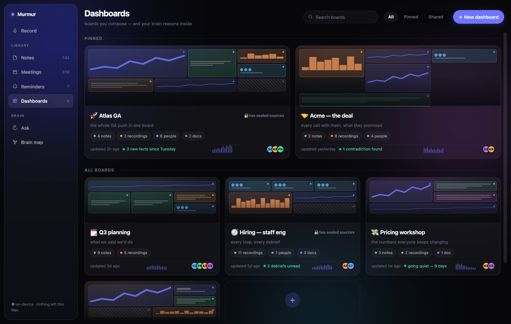
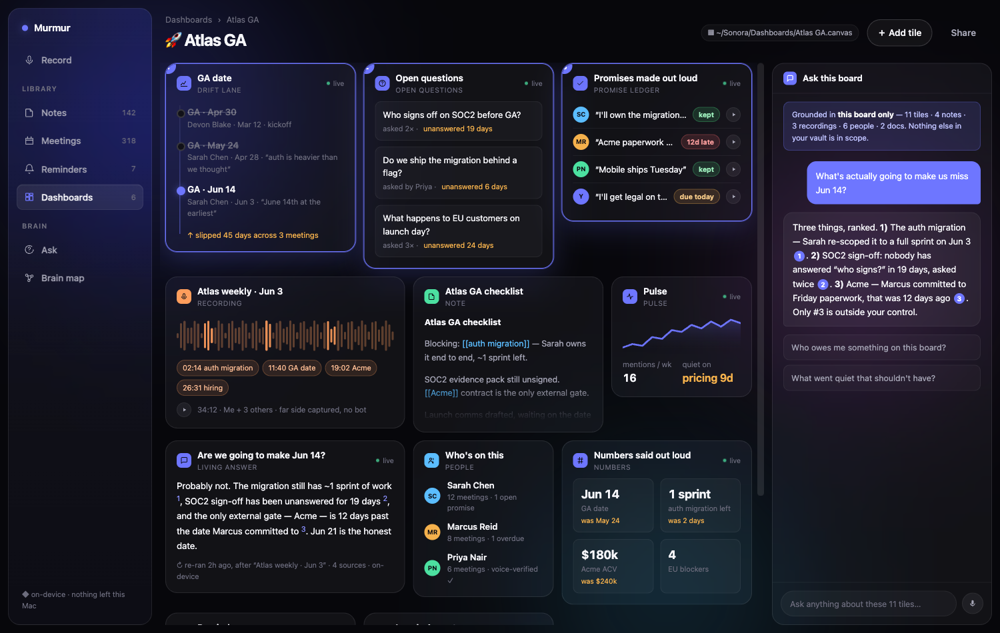
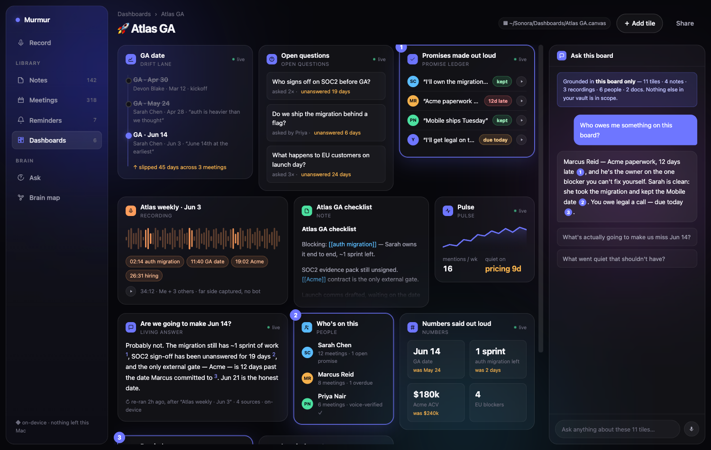
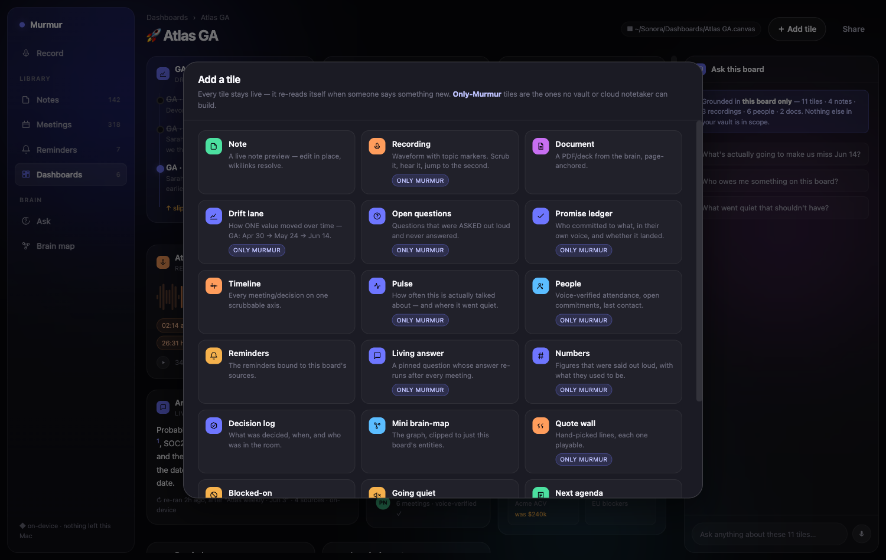

<!-- Dreamed 2026-08-03 via /dreaming (wave 2, user-steered). Vibe prototype — fake data, not production. -->
# Dream: Dashboards — the board your brain thinks inside

Wave 1 of this session (`2026-08-03-spoken-schema.md`) attacked Obsidian's dashboards from the **fuel**
side: Bases/Dataview run on hand-typed YAML, and only a voice-native app can fill it from the air.
The user then steered: *"a Dashboards tab, like Notes/Meetings/Reminders — compose notes + recordings +
timelines + reminders in one view, fully customizable, and the brain is AWARE of the dashboard's
connections."* This is that dream, and it is the other half of the same kill.

## The honest warning, first

**A tile-grid dashboard is, on its own, generic.** Notion, Coda, Obsidian Canvas, and every cloud
notetaker can ship a customizable board. If we build only "drag cards onto a canvas", we have built a
worse Notion.

Three things — and only these three — make it un-copyable:

1. **The board is a retrieval scope, not a view.** The user hand-composes the universe a question is
   allowed to be answered from. Auto-RAG guesses scope; a board *declares* it. Our Ask already supports
   pinned `explicit_sources`; a dashboard is that, made spatial and permanent.
2. **Tiles are alive because the input is speech.** A Notion board goes stale the second you stop
   typing. Ours re-reads itself when someone *says* something — the drift lane moves, the promise flips
   to late, the pulse goes quiet. Same engine as wave 1.
3. **The board is lockable and hearable.** A sealed folder's tile is redacted in place — a board you can
   screen-share as-is (`relock_all` on screen-share already exists) — and every quote-bearing tile plays
   the actual tape, voiceprint-matched, on-device.

Plus: it saves as a **`.canvas` in the user's vault** (`export/canvas.rs` already emits Obsidian Canvas
JSON). So the board outlives us — and it beats Obsidian Canvas at Obsidian Canvas, because *theirs is a
photograph and ours is a live feed.*

## The node catalogue  (19 types — the "what else could live here" answer)

**Material** — Note · Recording · Document
**Time** — Drift lane* · Timeline · Pulse*
**Commitment** — Promise ledger* · Reminders · Blocked-on* · Next agenda*
**Knowledge** — Open questions* · Living answer* · Numbers* · Decision log · Mini brain-map · Quote wall*
**People** — People* (voice-verified attendance)
**Meta** — Going quiet* · Sealed source*

`*` = **only Murmur can build it.** The ones I'd fight for, in order:

1. **Open questions** — questions that were *asked out loud* and never answered, with an age. Requires a
   transcript; no vault or Notion board can ever have this. Emotionally it is the sharpest tile on the
   board ("unanswered 24 days").
2. **Promise ledger** — who committed to what, in their own voice, kept/late/due — each row playable.
3. **Drift lane** — how ONE value moved: `GA: Apr 30 → May 24 → Jun 14`, each step attributed to a person
   and a sentence. Straight off the bitemporal `facts.rs` supersessions.
4. **Living answer** — a pinned question whose answer *re-runs after every meeting*. A dashboard cell that
   thinks.
5. **Going quiet** — the inverse dashboard: what nobody has mentioned in N days. Dashboards show what you
   have; this shows what is dying silently.
6. **Numbers** — figures said out loud, *with what they used to be* ("$180k — was $240k"), which is where
   the "nobody decided this" moments surface.

## Prototype

`docs/dreams/prototypes/dashboards/index.html` — two screens, click through both.

**Screen 1 — the Dashboards tab** (a real sibling of Notes/Meetings/Reminders): pinned + all boards,
each card carrying a **true miniature of its own tile layout** (sparklines, waveforms, text lines,
people dots, hatching for sealed), live counts by source type, an activity sparkline, the people on it,
"3 new facts since Tuesday", "going quiet — 9 days".

**Screen 2 — a board open**: 11 live tiles + the **Ask this board** column. Ask is scoped
("Grounded in *this board only* — 11 tiles · 4 notes · 3 recordings · 6 people · 2 docs") and when it
answers, **the tiles it used light up and number themselves [1][2][3]** — the whole point, made visible.
`＋ Add tile` opens the full node catalogue with the *only-Murmur* ones badged.

## What it'd really take

| Piece | Real seam | Size |
| --- | --- | --- |
| Boards + tiles storage | New additive tables (`dashboards`, `dashboard_tiles`) in `storage/` — `CREATE TABLE IF NOT EXISTS`, additive-only. | **S** |
| Tab + list + grid FE | New `features/dashboards/`; `mur-card`/`mur-table`/`mur-empty-state` exist; the mini-preview is pure CSS. | **L** (the rich list is most of it) |
| Board-scoped Ask | `summarize/vault_context.rs::build_vault_context_pinned_visible` already scopes Ask to pinned sources — a board is just a bigger, saved pin-set. Citations back to tiles are new. | **M** |
| Only-Murmur tiles | Open questions = new extraction pass; Promise ledger ≈ `summarize/action_items.rs` + voice attribution; Drift lane = `facts_store` supersessions (**free**); Pulse/Going quiet = mention counts over `meetings`; Numbers = facts with numeric objects. | **M–L** total, but each tile ships alone |
| Sealed tile | `meeting_is_unlocked` / `visibility_clause` — the tile renders redacted, and **every tile read must be gated** or it's a leak. | **M** |
| `.canvas` export | `export/canvas.rs` already emits Canvas JSON; needs a board→canvas mapping. | **S** |

**Total: L–XL** — but it is genuinely incremental: tab + boards + 3 tiles (Note, Recording, Drift) is a
shippable first slice; every other tile is additive after that.

**Honest limits.** Every tile is a content read → every tile needs the lock gate, and the sealed tile
needs `lock-security-reviewer` before merge. Tile *quality* (are the "open questions" real questions?)
can't be judged headlessly — real vault, real Mac. And the moment a board can be shared, the redaction
story has to hold on the *server* side too (`../murmur-server/`), not just in the UI.

## Verdict  (accepted / rejected / iterate — filled after the user disposes)

_pending — awaiting the user's call._
