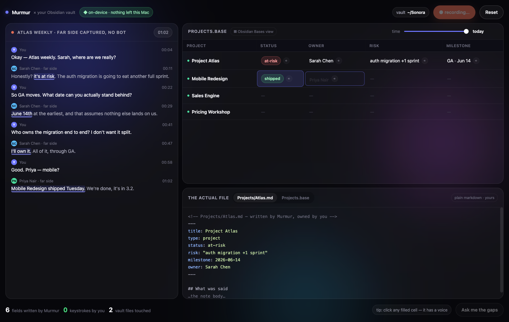
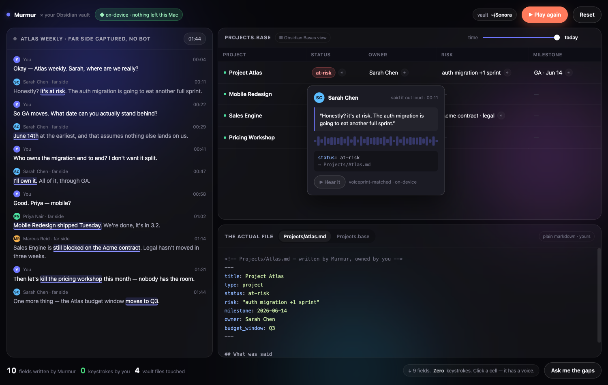
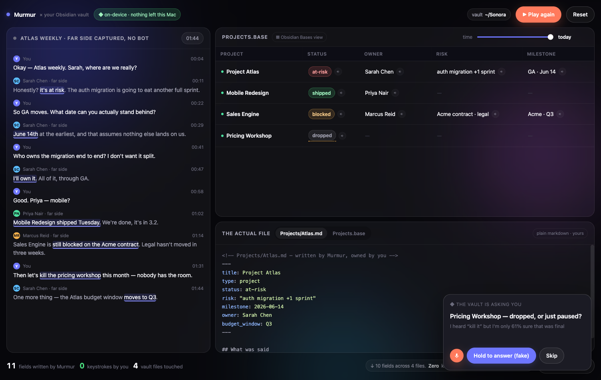
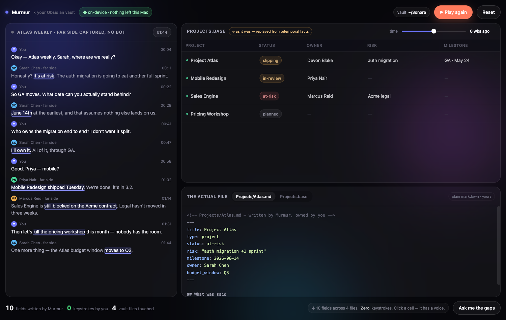

<!-- Dreamed 2026-08-03 via /dreaming. Prototypes are vibe-prototypes (fake data, not production). -->
# Dream: Spoken Schema — the dashboard you never fill in

**The question:** *"people build dashboards in Obsidian — what could kill an Obsidian like that?"*

The answer this dream lands on is not "build a better Obsidian". It is: **Obsidian's dashboards run
on fuel it cannot produce.** Dataview and Bases are both queries over metadata a human typed by hand —
YAML front-matter, inline `key:: value`, tags. Every survey of why vaults die says the same thing:
*"the maintenance burden grows faster than the value"*, *"the 'maintaining the system' part is what
kills most setups"*. Bases made the **view** free and left the **fuel** manual. Obsidian has no
microphone, no far-side capture, no on-device brain — it structurally cannot fix that.

Murmur can. You already say the metadata out loud, in every meeting, forever.

## The spark  (3 survivors)

1. **Spoken Schema** ⭐ *(prototyped)* — *What if your Obsidian dashboards filled themselves from what
   people said out loud?* On-device extraction turns real sentences into `status:`, `owner:`, `risk:`,
   `milestone:` in the **real `.md` files across your vault** — one meeting touching four notes — and
   Murmur even writes the `Projects.base` view for you. Every cell keeps its **voice**: click it and you
   see who said it, when, the quote, and you can hear the tape. Not a Murmur dashboard — *your Obsidian
   dashboard, on fuel only we can make.*
2. **The Gap — the vault asks you** *(in the prototype, act 3)* — Reverse the direction. A stale or
   low-confidence field doesn't sit there empty waiting for you; between meetings Murmur asks **one
   spoken question** ("Sales Engine — is Acme signing this quarter?"), you answer in one sentence, the
   column fills, the `.md` is written. The anti-maintenance-burden mechanic: the system feeds itself by
   asking, not by nagging you to type.
3. **The Time Scrubber** *(in the prototype, act 4)* — Drag time and the whole dashboard becomes what it
   *was*: Atlas was `slipping`, owned by Devon Blake, GA May 24 — six weeks ago. Obsidian has file
   history; it has no *semantic* history. We already store both time axes (`facts.rs`
   `valid_from`/`valid_to`), so this is a read, not a new system.

## The wide spread  (31 ideas · the graveyard is the point)

**SCAMPER on "a dashboard"**
1. **Substitute — speech replaces the keyboard as the metadata source.** ⭐ survivor #1
2. **Combine — dashboard + tape:** every cell is clickable audio provenance. ⭐ folded into #1
3. **Adapt — emit `.base` files**, Obsidian's own native view format, generated by us. ⭐ folded into #1
4. Modify — the *spoken* dashboard: a 90-second morning bulletin, on-device voice, no screen.
5. Put-to-other-use — the open-commitments table becomes the **agenda** of the next call, closing rows live as people say "done".
6. Eliminate the dashboard — no view at all, only living answers that rewrite themselves as `.md`.
7. **Reverse — the dashboard interrogates you** in a 20-second gap. ⭐ survivor #2
8. Eliminate the query language — you *say* "show me everything Kasia promised and didn't do" and a durable `.base` is born.

**Cross-domain raid** (banned the espionage/finance/games worlds earlier waves already mined)
9. Hydrology — the vault as a watershed: which topics are *rising*, which are drying up; a flood alarm when a topic recurs 5× with nothing decided.
10. Mise en place — before a call, everything laid out in order of use, not in a table.
11. Air-traffic strip board — each commitment is a strip; "holding pattern" = things circling, never landing.
12. ER triage board — what is bleeding out right now, ranked, not filtered.
13. Archaeological stratigraphy — the dashboard as layers; how your belief about X changed over 8 months. → became ⭐ survivor #3.
14. Registered post — each commitment carries a **delivery receipt**: who heard it out loud and didn't object.
15. Dead reckoning (sailing) — where the project *should* be vs where the talk says it is.
16. Sowing calendar — notes have a ripening time; "this is ready to harvest"; compost for dead knowledge.
17. Mixing desk — channels are people/topics, faders are how much of your life they take; solo/mute.
18. Snag list (construction) — an automatic defect list after every site meeting, signed by voice.
19. CB radio scanner — background listening that interrupts only on a watch-list topic.
20. Leading indicators (central bank) — not state but *prediction*: someone stopped saying "we" and started saying "they".

**Only-Murmur-could**
21. **Voice provenance in a cell** — hear the sentence a value came from. ⭐ folded into #1
22. Lock-aware dashboard — sealed folders' columns redacted, Touch ID reveals, screen-share auto-redacts: a table you can show on a call.
23. **Bitemporal scrubber.** ⭐ survivor #3
24. Far-side columns — fields fuelled by what the *client* said (ScreenCaptureKit, no bot): "their promises", a column no vault on earth has.
25. Enrich notes we didn't write — Murmur fills front-matter on your *hand-written* notes too (the brain already reads the whole vault).
26. Self-auditing dashboard — every field carries "how I know this" and flags its own guesses.

**Enemy move / fresh platform**
27. Obsidian ships Bases + an AI plugin → our counter: a **Murmur plugin inside Obsidian** — we are the engine, it is the viewer.
28. Spotlight/Quick Look — type "atlas", see live facts from the vault.
29. Menu-bar "today" — the three things you promised out loud this morning.
30. Apple Foundation Models — free on-device field extraction, zero egress, zero cost.
31. Living `.canvas` — the dashboard as an Obsidian canvas that rearranges itself (we already emit `.canvas`).

**Killed for genericness** (any cloud notetaker could ship these): #4 as a standalone, #12, #17, #29
on their own. They only earn a place *attached* to survivor #1.

## Why these survived  (atom + emotion)

- **#1 Spoken Schema** stands on four atoms at once — **voice** (the fuel), **on-device** (extraction of
  every project's status without a byte leaving), **owned files** (we write *your* `.md`, not our DB),
  **far-side capture** (the client's own words become columns). The emotion is the counter reading
  **`0 keystrokes by you`** while ten fields land across four files. It kills Obsidian by *feeding* it —
  we become the only fuel line, and it never notices it's been captured.
- **#2 The Gap** is the only answer anyone has to "vaults die of maintenance". A typed prompt is a chore;
  **one spoken sentence** is not. Only a voice-native, always-on-device app can charge that little for
  an update.
- **#3 Time Scrubber** stands on the brain: bitemporal facts already exist in `facts.rs`. It is the
  cheapest of the three and the most obviously impossible for a file-based tool.

## Prototype

`docs/dreams/prototypes/spoken-schema/index.html` — open it, press **▶ Play the meeting**.

Four acts, all faked (fake ASR, fake extraction, fake audio, fake vault):
1. **Empty Base** — the table sits there with `—` in every cell: Bases waiting for YAML you never wrote.
2. **It writes itself** — the meeting plays, phrases light up, cells pop in, `Atlas.md`'s front-matter
   grows line by line, the counter climbs to *10 fields · 0 keystrokes · 4 files*.
3. **Every cell has a voice** — click one: Sarah Chen, 00:11, the quote, a waveform, "→ Projects/Atlas.md".
4. **The Gap** and the **time scrubber** — the vault asks you one question; drag time and the dashboard
   becomes what it was six weeks ago.

## What it'd really take  (real seams, honest sizing)

The good news: **most of the machinery already exists** — this is mostly a wiring + surface job.

| Piece | Real seam in the tree | Size |
| --- | --- | --- |
| Extract `field: value` from a transcript | `facts.rs::extract_fact_candidates` + `reconcile_facts` already produce `entity·predicate·object` **bitemporally**. Needs a predicate→front-matter-key mapping and a confidence floor. | **M** |
| Write fields into **other** notes | `export/obsidian.rs` (`overwrite_owned_snapshot`, atomic `renameatx_np`) + `summarize/template.rs::deterministic_front_matter_lines` / `extra_frontmatter_keys`. Today we own the *meeting* note; writing a *project* note is the new part — and touching files we didn't author needs the export-collision guard and an undo (the Re-Truth pre-image pattern, `storage/facts_store.rs::store_supersession_pre_images`). | **L** |
| Generate `Projects.base` | New tiny emitter beside `export/canvas.rs`. Format is plain YAML. | **S** |
| Cell → voice provenance | Each fact already carries `meeting_id`; segments + audio are there. New gated command `get_fact_provenance` + the existing `meeting_is_unlocked` gate. **Audio for a sealed folder must stay `audio_path: None`** (the `convertFileSrc` trap). | **M** |
| The Gap (vault asks you) | `commands/reminders.rs` + the brief/digest scheduler already exist; the spoken answer path is `transcribe/live.rs`. | **M** |
| Time scrubber | Pure read over `valid_from`/`valid_to` via `list_facts_visible`. | **S** |
| FE | One new feature dir (`features/base/`), signals + `IpcService`, `mur-table` already exists in the design system. | **M** |

**Total: L.** Realistically two shippable slices — (A) *fields + `.base` + provenance* is the killer and
is self-contained; (B) *The Gap + scrubber* rides on top.

**Honest limits.**
- **Writing into notes Murmur did not author is the single risky part of this dream.** It is the one place
  where a bug costs a user their own words. Non-negotiable: front-matter-only writes, byte-exact
  pre-image undo, never touching the body, and the `lock-security-reviewer` gate.
- Extraction quality can't be judged headlessly — it needs a **real vault on a real Mac**, and the honest
  failure mode is a confidently wrong `status:`. The prototype's dotted-underline "61% confidence" cell is
  the design answer: low-confidence fields are *questions*, not facts.
- Obsidian Bases' file format should be verified against the shipped spec before we emit `.base` (the
  prototype's YAML is plausible, not confirmed).
- Nothing here needs a signed build except the audio-playback leg (asset-protocol gating).

## Verdict  (accepted / rejected / iterate — filled after the user disposes)

_pending — awaiting the user's call._
